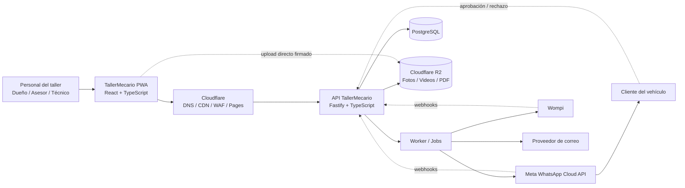
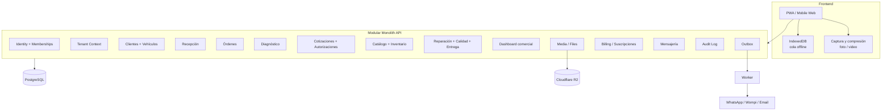
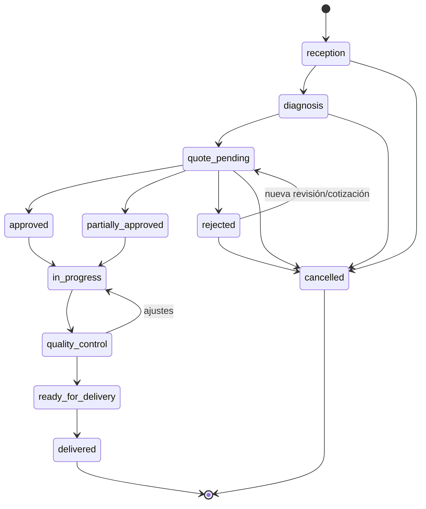
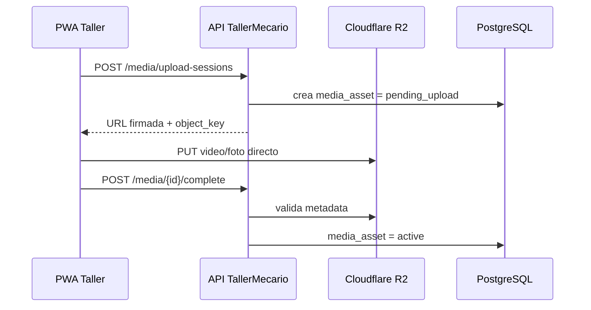
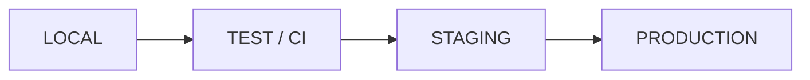

# Arquitectura Técnica v1 — TallerMecario

<aside>
🎯

**Objetivo:** definir una arquitectura SaaS multitenant, segura, auditable y de bajo costo operativo para comercializar TallerMecario en Colombia, soportando recepción de vehículos, video 360°, órdenes, cotizaciones, autorizaciones, WhatsApp y suscripciones.

</aside>

**Estado:** Baseline documental v1 cerrado — Documentation Freeze levantado; implementación/Quality Gate de Sprint 0 pendientes  

**Alcance:** MVP comercial → piloto 3–5 talleres → escalamiento progresivo  

**Relacionado:** [Metodologia Scrum 2 week  + Gates (RoadMap)](Metodologia%20Scrum%202%20week%20+%20Gates%20(RoadMap)%203de6ab0a330d80cc94e0dc6f270efdf0.md) · [Sprint 0 Backlog](Metodologia%20Scrum%202%20week%20+%20Gates%20(RoadMap)/Sprint%200%20Backlog%203de6ab0a330d807faf46ce81d957ecba.md) · [Diccionario de Datos v1 — PostgreSQL](Arquitectura%20T%C3%A9cnica%20v1%20%E2%80%94%20TallerMecario/Diccionario%20de%20Datos%20v1%20%E2%80%94%20PostgreSQL%203e06ab0a330d815fbb32e6200f8d5417.md)

# 1. Principios arquitectónicos

1. **Modular Monolith primero:** un backend desplegable, dividido por dominios internos claros. Evita microservicios prematuros, reduce costo y simplifica operación.
2. **Multitenancy desde la primera migración:** ninguna entidad de negocio existe sin contexto de taller.
3. **PostgreSQL es la fuente de verdad:** estados, autorizaciones, pagos, historial y auditoría viven en base de datos.
4. **Archivos fuera de PostgreSQL:** fotos, videos y PDF se almacenan en Cloudflare R2; la base solo guarda metadata y referencias.
5. **Videos nunca atraviesan el backend:** el navegador/app solicita una URL firmada y carga directamente a R2.
6. **Integraciones asíncronas:** WhatsApp, Wompi y correo no deben bloquear una operación crítica del taller.
7. **Idempotencia obligatoria:** webhooks, pagos, sincronización offline y reintentos deben poder ejecutarse más de una vez sin duplicar efectos.
8. **Offline tolerante:** la recepción debe poder continuar ante Internet inestable y sincronizar después.
9. **Auditoría por defecto:** cambios sensibles deben registrar quién, cuándo, qué cambió y desde qué taller.
10. **Infraestructura portable:** frontend estático + contenedores Docker + PostgreSQL + almacenamiento S3-compatible para poder cambiar proveedor sin reescribir el producto.

# 2. Arquitectura de contexto



# 3. Arquitectura lógica



## Decisión estructural

**No usar microservicios en el MVP.** Los dominios serán módulos internos independientes con contratos claros, pero compartirán un único despliegue y una única base PostgreSQL. Si en el futuro un módulo genera carga desproporcionada —por ejemplo procesamiento de video o mensajería— se podrá extraer sin rediseñar el resto.

# 4. Stack base propuesto

| Capa | Tecnología | Responsabilidad |
| --- | --- | --- |
| Frontend | React + TypeScript + Vite + PWA | Operación móvil/desktop y experiencia offline |
| API | Node.js + Fastify + TypeScript | Reglas de negocio y API REST |
| Validación | Zod | Contratos de entrada/salida y validación |
| Persistencia | PostgreSQL + Drizzle ORM/SQL | Datos transaccionales y migraciones |
| Archivos | Cloudflare R2 | Videos, fotos, firmas exportadas y PDF |
| Frontend hosting | Cloudflare Pages | CDN global y despliegue estático |
| Backend compute | Contenedor Docker en VPS o Azure Container Apps | API stateless y worker |
| Mensajería | Meta WhatsApp Cloud API | Cotizaciones, estados y recordatorios |
| Pagos | Wompi mediante adaptador interno | Suscripción del taller y eventos de pago |

<aside>
🔌

**Autenticación:** Clerk es el Identity Provider seleccionado en ADR-006 y se mantiene detrás de una interfaz `IdentityProvider` desacoplada del negocio. Memberships, roles y tenant activo siempre pertenecen a PostgreSQL.

</aside>

# 5. Multitenancy

## Modelo recomendado: base compartida + esquema compartido

Cada taller es un `tenant`. Las tablas de negocio incluyen `tenant_id` y las operaciones se ejecutan dentro de un `TenantContext` obligatorio.

**Verificación S1-08:** request con JWT de Clerk verificado → membership activa seleccionada en PostgreSQL → `TenantContext` → GUC `app.*` fijados con `SET LOCAL` dentro de la transacción → RLS `ENABLE + FORCE` bajo API/worker `NOBYPASSRLS`. Los claims `org_role`, `org_permissions` y metadata de Clerk no conceden tenant ni permisos. La conexión reutilizada no conserva GUC tras COMMIT/ROLLBACK, incluido error, retorno temprano o denegación.

```
Tenant / Workshop
   │
   ├── Memberships ── Users
   ├── Customers
   │      └── Vehicles
   ├── Service Orders
   ├── Quotes
   ├── Media
   ├── Appointments
   ├── Notifications
   └── Subscription
```

### Reglas no negociables

- `tenant_id` tipo UUID en toda tabla perteneciente al taller.
- Las consultas de negocio **nunca** reciben un `tenant_id` arbitrario desde el body; sale del contexto autenticado.
- Índices y `UNIQUE` deben incluir `tenant_id` cuando la unicidad sea local al taller.
- Claves foráneas críticas deben impedir cruzar registros entre tenants.
- Repositorios/servicios reciben `TenantContext` explícitamente.
- Pruebas automáticas de aislamiento entre dos talleres en cada módulo crítico.
- PostgreSQL Row Level Security (RLS) será defensa en profundidad obligatoria desde la migración que introduzca cada tabla tenant-owned; no reemplaza RBAC ni FKs compuestas. API/worker usan roles `NOBYPASSRLS`, no propietarios, y TenantContext transaction-local. Política canónica: [ADR-009 — RLS y privilegios PostgreSQL por TenantContext](Arquitectura%20T%C3%A9cnica%20v1%20%E2%80%94%20TallerMecario/ADR-009%20%E2%80%94%20RLS%20y%20privilegios%20PostgreSQL%20por%20TenantC%203e06ab0a330d8162b0cfff78ad1cb9b1.md).

## Entidades base de tenancy

```
workshops
workshop_locations  # exactamente una is_primary por workshop; onboarding la crea en la misma transacción
users
memberships
membership_invitations
roles
permissions
membership_roles
```

Roles baseline:

- `owner`
- `admin`
- `service_advisor`
- `technician`

**Matriz canónica de autorización:** [RBAC — Matriz completa de roles y permisos v1](Arquitectura%20T%C3%A9cnica%20v1%20%E2%80%94%20TallerMecario/RBAC%20%E2%80%94%20Matriz%20completa%20de%20roles%20y%20permisos%20v1%203e06ab0a330d81d398ffe925a65506c8.md)

La autorización es deny-by-default y se evalúa por permission codes server-side; los roles no se usan como atajos dispersos dentro del dominio.

# 6. Dominios y modelo de datos

| Dominio | Entidades principales |
| --- | --- |
| Identidad | users, workshops, memberships, membership_invitations, roles, permissions |
| CRM | customers, vehicles, vehicle_owners |
| Recepción | receptions, reception_check_items, vehicle_damages, signatures |
| Archivos | media_assets, upload_sessions, reception_media, damage_media, finding_media, work_activity_media, quality_check_media, delivery_media, quote_media |
| Órdenes | service_orders, service_order_items, order_status_history, assignments |
| Diagnóstico | diagnostics, findings, recommendations |
| Catálogo | catalog_items |
| Inventario / analítica comercial | inventory_balances, inventory_movements + dashboard derivado |
| Cotización | quotes, quote_versions, quote_items, quote_authorization_tokens, quote_authorization_challenges, quote_authorizations, quote_authorization_items |
| Operación | work_activities, technician_logs, quality_checks, deliveries |
| Agenda | appointments, reminders |
| Comunicaciones / acceso cliente | tenant_whatsapp_accounts, message_threads, messages, customer_order_access_tokens |
| Billing SaaS | plans, subscriptions, billing_events, payments |
| Pagos operativos | customer_payments, customer_payment_allocations, customer_payment_reconciliation_runs |
| Privacidad / cumplimiento | privacy_consents, data_subject_requests, privacy_security_incidents, legal_acceptances |
| Plataforma | audit_logs, webhook_events, outbox_events, sync_operations, feature_flags |

## Convenciones de datos

**Contrato canónico de columnas/tipos:** [Diccionario de Datos v1 — PostgreSQL](Arquitectura%20T%C3%A9cnica%20v1%20%E2%80%94%20TallerMecario/Diccionario%20de%20Datos%20v1%20%E2%80%94%20PostgreSQL%203e06ab0a330d815fbb32e6200f8d5417.md).

- PK: UUID/UUIDv7 o identificador equivalente generado por aplicación.
- Fechas: `timestamptz` en UTC.
- Dinero: entero en unidad mínima o `numeric`, nunca `float`.
- Estados: CHECK/enum controlado + máquina de estados en dominio.
- Soft delete solo cuando exista necesidad de negocio; auditoría no sustituye integridad referencial.
- Campos mínimos de trazabilidad: `created_at`, `updated_at`, `created_by`, cuando aplique.

# 7. Máquina de estados de la orden



Los cambios de estado deben ejecutarse por comandos de dominio (`approveQuote`, `startRepair`, `completeQualityControl`, etc.), **no** mediante un endpoint genérico que permita escribir cualquier estado.

**Especificación completa de lifecycle por dominio:** [Estados y Transiciones por Dominio v1](Arquitectura%20T%C3%A9cnica%20v1%20%E2%80%94%20TallerMecario/Estados%20y%20Transiciones%20por%20Dominio%20v1%203e06ab0a330d819080edfe450a75a7f5.md). Además de `service_orders`, quedan formalizadas las máquinas de `diagnostics`, `quotes`, `deliveries`, `subscriptions` y el estado efectivo derivado de `feature_flags`.

# 8. Arquitectura de archivos y video 360°

## Flujo de carga



### Estados de archivo

`pending_upload → uploaded → active → quarantined/deleted`

### Reglas

- Compresión de video en dispositivo cuando sea viable.
- Nunca almacenar blobs en PostgreSQL.
- `object_key` debe incluir un identificador interno del tenant, no datos personales visibles.
- Descargar mediante URLs firmadas de corta duración.
- Hash/checksum cuando el flujo lo permita.
- Reintentos de carga sin duplicar registros.
- Retención baseline: uploads incompletos 24 h; media operacional 12 meses tras orden terminal; media ligada a garantía conserva hasta el mayor entre ese plazo y `warranty_expires_at + 90 días`; firmas/PDF/evidencia de autorización-entrega 36 meses como default de producto.
- La política completa, legal hold, two-phase delete y purge R2 viven en [Operación, Retención, Recuperación y Observabilidad v1 — TallerMecario](Arquitectura%20T%C3%A9cnica%20v1%20%E2%80%94%20TallerMecario/Operaci%C3%B3n,%20Retenci%C3%B3n,%20Recuperaci%C3%B3n%20y%20Observabilida%203e06ab0a330d819ea376f6f7628679f6.md).

# 9. Offline y sincronización

**ADR canónico aceptado:** [ADR-005 — PWA + IndexedDB para operación offline](Arquitectura%20T%C3%A9cnica%20v1%20%E2%80%94%20TallerMecario/ADR-005%20%E2%80%94%20PWA%20+%20IndexedDB%20para%20operaci%C3%B3n%20offline%203e06ab0a330d81a58a05dabdf042f145.md).

La recepción es el caso offline prioritario. IndexedDB mantiene drafts estructurados y `sync_queue`; PostgreSQL sigue siendo la única fuente de verdad. Background Sync es una optimización opcional, no dependencia de corrección, y las operaciones sensibles (autorizaciones, pagos confirmados/reversos, roles/ownership y otras transiciones server-authoritative) requieren servidor.

```
PWA
 ├─ IndexedDB
 │   ├─ clientes temporales
 │   ├─ vehículos temporales
 │   ├─ recepción
 │   └─ sync_queue
 │
 └─ Sync Engine
      ├─ online → enviar pendientes
      ├─ retry con backoff
      ├─ idempotency_key
      └─ resolución de conflictos
```

### Reglas de sincronización

- IDs pueden generarse en cliente para operaciones offline.
- Cada mutación lleva `operation_id`/`idempotency_key` único.
- El servidor registra operaciones ya aplicadas.
- Operaciones append-only, como evidencias y observaciones, se fusionan.
- Ediciones concurrentes sensibles utilizan `version`/`updated_at` y rechazo explícito del conflicto.
- El usuario debe ver: **pendiente**, **sincronizando**, **sincronizado**, **error**.
- Video/fotos pueden quedar pendientes hasta recuperar conectividad sin impedir guardar la recepción local.

# 10. Integraciones y procesamiento asíncrono

## Patrón Outbox

Toda acción que deba comunicarse a un tercero primero se confirma en PostgreSQL y luego se publica como evento interno.

```
Transacción DB
   ├── cambia negocio
   └── INSERT outbox_event
              ↓
           Worker
              ↓
   WhatsApp / Wompi / Email
```

Esto evita perder mensajes cuando el proveedor externo falla después de haber confirmado una operación interna.

## Webhooks

`webhook_events` conserva el evento externo original como append-only: `provider`, `provider_event_id`, `tenant_id nullable`, `payload_hash`, `payload_json`, metadata permitida de headers/firma y `received_at`. No contiene contadores ni estado mutable de procesamiento.

Los reintentos viven en `webhook_processing_attempts`: `webhook_event_id`, `attempt_number`, `status`, timestamps, error y metadata del worker/request.

`UNIQUE(provider, provider_event_id)` evita duplicados de transporte. La idempotencia de negocio se aplica además por identificadores del proveedor (`transaction.id/status` en Wompi; `wamid/status` en WhatsApp). La firma se verifica antes de producir efectos y el ACK se devuelve rápido después de persistencia durable; el worker procesa asíncronamente.

**Contrato canónico de payloads/webhooks:** [Contratos Externos — Wompi + WhatsApp v1](Arquitectura%20T%C3%A9cnica%20v1%20%E2%80%94%20TallerMecario/Contratos%20Externos%20%E2%80%94%20Wompi%20+%20WhatsApp%20v1%203e06ab0a330d814aaa72e80f2a7c7f10.md).

# 11. Wompi y suscripciones

Separar **billing del taller** del flujo operativo del vehículo.

```
Plan
  ↓
Subscription
  ↓
Billing Attempt / Payment
  ↓ webhook
Billing Event
  ↓
Entitlements / Feature Flags
```

El módulo de negocio no pregunta directamente a Wompi para saber si un taller puede usar una función. Consulta el estado local de la suscripción y sus `entitlements`; los webhooks sincronizan esa verdad con el proveedor.

Estados internos: `trialing`, `active`, `past_due`, `suspended`, `cancelled`. Sus transiciones, guards y condición terminal están definidas en [Estados y Transiciones por Dominio v1](Arquitectura%20T%C3%A9cnica%20v1%20%E2%80%94%20TallerMecario/Estados%20y%20Transiciones%20por%20Dominio%20v1%203e06ab0a330d819080edfe450a75a7f5.md).

**Payloads, headers, firma, mapeo de estados, dedupe y reconciliación Wompi:** [Contratos Externos — Wompi + WhatsApp v1](Arquitectura%20T%C3%A9cnica%20v1%20%E2%80%94%20TallerMecario/Contratos%20Externos%20%E2%80%94%20Wompi%20+%20WhatsApp%20v1%203e06ab0a330d814aaa72e80f2a7c7f10.md).

Protecciones obligatorias:

- idempotencia en creación/confirmación de pagos;
- webhooks firmados;
- conciliación periódica;
- historial inmutable de eventos de billing;
- período de gracia configurable antes de bloquear operación;
- nunca eliminar información del taller por mora.

# 12. WhatsApp

WhatsApp será un canal, no la fuente de verdad.

**Modelo comercial/técnico MVP:** cada taller conecta su propia WABA/número y paga directamente a Meta su consumo. ILVOX opera la integración con autorización del tenant, pero no centraliza línea de crédito ni refactura mensajes. La suscripción SaaS sigue siendo taller → Wompi → ILVOX y permanece separada del consumo WhatsApp.

Resolución outbound:

```
TenantContext
   ↓
tenant_whatsapp_accounts (active)
   ↓
phone_number_id / WABA
   ↓
credential_secret_ref → secret store
   ↓
Meta WhatsApp Cloud API
```

Resolución inbound: `phone_number_id` del webhook → `tenant_whatsapp_accounts` único → tenant. Nunca se acepta `tenant_id` suministrado por el proveedor/cliente como autoridad.

**ADR:** [ADR-008 — WhatsApp por tenant con WABA propia y facturación directa Meta](Arquitectura%20T%C3%A9cnica%20v1%20%E2%80%94%20TallerMecario/ADR-008%20%E2%80%94%20WhatsApp%20por%20tenant%20con%20WABA%20propia%20y%20fa%203e06ab0a330d8108ae45e0e053e7675b.md).  

**Payloads outbound, templates, `wamid`, verificación GET/POST, `X-Hub-Signature-256`, dedupe y status webhooks:** [Contratos Externos — Wompi + WhatsApp v1](Arquitectura%20T%C3%A9cnica%20v1%20%E2%80%94%20TallerMecario/Contratos%20Externos%20%E2%80%94%20Wompi%20+%20WhatsApp%20v1%203e06ab0a330d814aaa72e80f2a7c7f10.md).

Casos iniciales:

- cotización enviada;
- enlace de aprobación/rechazo;
- vehículo en reparación;
- vehículo listo;
- recordatorio de cita;
- próximo mantenimiento.

Los enlaces públicos deben usar tokens aleatorios de un solo propósito y expiración. La credencial previa de aprobación vive en `quote_authorization_tokens`; antes de ejecutar una decisión pública se exige OTP on-demand mediante `quote_authorization_challenges`; la decisión final append-only vive en `quote_authorizations`. El link puede mostrar la cotización sin OTP, pero aprobar/rechazar/parcial requiere challenge verificado vigente. La decisión registra versión exacta, token/challenge consumidos, fecha, canal, IP/contexto disponible y evidencia de autorización.

**Separación obligatoria:** el usuario interno entra por Clerk + membership/RBAC. El cliente final nunca obtiene un rol RBAC: para seguimiento utiliza `customer_order_access_tokens` ligado por FK a una orden específica. El token se almacena hasheado, puede expirar/revocarse y solo habilita un DTO público mínimo. El token de seguimiento **no sirve** para aprobar cotizaciones y el token de cotización no sirve para navegar el seguimiento general.

# 13. API y contratos

Base: `/api/v1`.

Convenciones:

```
POST   /api/v1/membership-invitations
POST   /api/v1/membership-invitations/accept
POST   /api/v1/customers
GET    /api/v1/customers/:id
POST   /api/v1/vehicles
POST   /api/v1/receptions
POST   /api/v1/orders/:id/diagnostics
POST   /api/v1/orders/:id/quotes
POST   /api/v1/quotes/:id/send
POST   /api/v1/quotes/:id/authorizations/manual
GET    /api/v1/public/quotes/authorization/:token
POST   /api/v1/public/quotes/authorization/:token/challenges
POST   /api/v1/public/quotes/authorization/:token/challenges/:challengeId/verify
POST   /api/v1/public/quotes/authorization/:token/decision
GET    /api/v1/public/orders/:token
POST   /api/v1/media/upload-sessions
POST   /api/v1/webhooks/wompi
POST   /api/v1/webhooks/whatsapp
```

- JSON consistente.
- Validación estricta de payload.
- Errores con código de aplicación estable, `request_id` y mensaje seguro.
- `Idempotency-Key` en operaciones sensibles.
- Paginación cursor-based donde el volumen lo justifique.
- Versionamiento de API antes de comercialización.

## 13.1 Invitaciones internas (S1-04) — contrato backend ↔ PWA

```
POST /api/v1/membership-invitations              tenant route: memberships.invite_staff + roles.assign_{owner|admin|staff}
GET  /api/v1/membership-invitations              tenant route: memberships.read
POST /api/v1/membership-invitations/:id/revoke   tenant route: memberships.manage_staff (+ permiso de asignar el rol)
POST /api/v1/membership-invitations/accept       identity-only: sesión Clerk verificada + email PRIMARIO verificado; body {"token": "<43 chars base64url>"}
```

- **Aceptación identity-only:** el invitado aún no tiene membership ni TenantContext; tenant y rol salen de la invitación resuelta por hash exacto (ADR-009 §7.8), nunca del body/headers. El email primario verificado de Clerk debe ser igual (forma canónica) a `email_normalized`.
- **Link del correo:** `<MEMBERSHIP_INVITATION_ACCEPT_URL>#token=<token>` — el token viaja **solo en el fragmento**: el navegador no lo envía al host de la PWA (logs de CDN/hosting) ni en `Referer`. La PWA lo lee client-side, lo retira de la URL (`history.replaceState`) y lo envía en el body del POST `/accept`. Nunca en path ni query.
- **Errores estables** (`{ error: { code, message, request_id } }`): `INVITATION_ALREADY_PENDING` 409, `INVITATION_ROLE_NOT_ALLOWED` 403 (auditado, commit durable), `INVITATION_NOT_FOUND` 404, `INVITATION_INVALID` 404, `INVITATION_EXPIRED` 410, `INVITATION_REVOKED` 410, `INVITATION_ALREADY_ACCEPTED` 409, `INVITATION_EMAIL_MISMATCH` 403 (auditado), `MEMBERSHIP_ALREADY_EXISTS` 409, `INVITATION_IN_PROGRESS` 409 (**reintentar**: lock ocupado o envío de correo en curso; nada se confirmó).
- **Correo por outbox (ADR-004):** el job `membership.invitation_email_requested` (event_version **2**) se confirma con la invitación y lleva `invitation_id`, `token_nonce`, `token_key_version` y el **delivery snapshot** inmutable: `template_version, from, accept_url, workshop_name, role_label, expires_at`. Nunca token, hash ni email del invitado. Todo reintento reconstruye exactamente el mismo request a Resend bajo la misma `Idempotency-Key: membership-invitation/<invitation_id>` (destinatario re-leído: `email` es inmutable; token re-derivado del nonce). Cambiar `workshops.display_name`, sender o accept URL solo afecta invitaciones nuevas. Jobs event_version 1 (pre-fix, nunca liberados) fallan permanentemente con `INVITATION_EMAIL_EVENT_VERSION_UNSUPPORTED`.
- **Lease de entrega (0009):** DB corta → COMMIT → Resend (sin transacción/lock) → DB corta. Mientras el worker tiene un lease vigente (timeout del request + 15 s), revoke/accept responden `409 INVITATION_IN_PROGRESS` en lugar de confirmar; al terminar el envío (o vencer el lease) el reintento procede. `membership.invitation_email_sent` significa únicamente que el proveedor aceptó esa entrega; se registra una vez, junto con la liberación del lease y el `processed` del job.
- **Límite del lease:** coordina el envío bajo relojes normales de ejecución; una suspensión prolongada del host/VM del worker podría dejar salir un correo tardío tras vencer el lease (riesgo residual LOW, sin impacto de autorización: el token de una invitación terminal no es aceptable). Ver ADR-009 §9.
- **Pendiente (DECISION_REQUIRED, sin cambio en S1-04):** reactivar memberships `suspended/revoked` vía invitación (hoy 409 `MEMBERSHIP_ALREADY_EXISTS`); admin revocando invitaciones owner/admin (hoy denegado); pérdida de permiso del invitador antes de la aceptación (autorización capturada al crear); taller `suspended/cancelled` (sin gate); comando de reenvío (no existe); contrato `Idempotency-Key` del create.

## 13.2 Roles de memberships (S1-05) — contrato backend ↔ PWA

```
GET    /api/v1/memberships/:membershipId/roles             tenant route: memberships.read
POST   /api/v1/memberships/:membershipId/roles             tenant route: memberships.manage_staff (+ roles.assign_* en el servicio)
       body {"role_code": "owner" | "admin" | "service_advisor" | "technician"}   (additionalProperties: false)
DELETE /api/v1/memberships/:membershipId/roles/:roleCode   tenant route: memberships.manage_staff (+ roles.assign_* en el servicio)
```

- **Respuesta:** `{ "membership": { "membershipId", "status", "roles": [{ "role", "assignedAt" }] } }`, `cache-control: no-store`. POST → 201, DELETE → 200, GET → 200 (también para memberships `suspended`/`revoked`).
- **Autorización** (RBAC §4/§16/§18; solo permission codes, nunca nombres de rol): cambiar el rol R de la membership T exige `memberships.manage_staff`, el permiso de asignación de R **y** el de cada rol que T ya tiene (`owner → roles.assign_owner`, `admin → roles.assign_admin`, `service_advisor|technician → roles.assign_staff`). Efecto: admin gestiona solo staff y no puede tocar una membership que tenga owner/admin. Los permisos del actor se **releen de PostgreSQL después de los locks** (no del snapshot del inicio del request): un actor degradado mientras su request espera queda denegado. Nadie modifica sus propios roles (RBAC §16.6) → 403 `SELF_ROLE_MODIFICATION_FORBIDDEN`.
- **Nunca desde el cliente:** tenant (sale del TenantContext), `assigned_by_membership_id` (= membership del actor autenticado), listas de permisos, claims de Clerk (`org_role`, `org_permissions`, metadata). Campos extra en el body → 400.
- **Errores estables** `{ error: { code, message, request_id } }`: `MEMBERSHIP_NOT_FOUND` 404 (id inexistente, malformado o de otro tenant) · `MEMBERSHIP_NOT_ACTIVE` 409 · `ROLE_ALREADY_ASSIGNED` 409 · `ROLE_NOT_ASSIGNED` 404 · `LAST_OWNER_REQUIRED` 409 · `ROLE_ASSIGNMENT_NOT_ALLOWED` 403 (auditado `denied`, commit durable) · `SELF_ROLE_MODIFICATION_FORBIDDEN` 403 (auditado `denied`, commit durable) · `PERMISSION_DENIED` 403 · `REQUEST_VALIDATION_FAILED` 400 · `UNSUPPORTED_MEDIA_TYPE` 415.
- **Auditoría** (RBAC §20): `role.assigned` / `role.revoked`; `entity_type = membership_role`, `entity_id` = membership objetivo, `actor_user_id`/`actor_membership_id` = actor, `before_json`/`after_json = {roles:[…]}`, `metadata_json = {role}`; denegados con `reason_code = role_assignment_not_permitted` (+ `missing_permissions`) o `self_role_modification`. Sin email, token, JWT ni User-Agent (NULL).
- **Transacción única:** `app.lock_current_tenant_owner_set()` (puerta global compartida + fila `workshops` del tenant del TenantContext; ver ADR-009 §10.1) → actor `FOR SHARE` → objetivo `FOR UPDATE` → permisos frescos → invariantes → INSERT/DELETE en `membership_roles` (nunca UPDATE) → audit → COMMIT. Cualquier error → ROLLBACK total (salvo los dos 403 durables, que confirman solo su fila `denied`).
- **Invariante de owner activo** garantizado en PostgreSQL (migraciones `0011`–`0014`), también frente a cambios de `memberships.status`; ver ERD (RBAC › Invariante de owner activo) y ADR-009 §10.1.
- **No incluido:** comando de reemplazo atómico de rol; `Idempotency-Key` para roles. La gestión de estado `suspend`/`revoke` se define en §13.3.
- **Pendiente (DECISION_REQUIRED, sin cambio en S1-05):** (1) cambios de roles sobre memberships `suspended`/`revoked` (hoy 409 `MEMBERSHIP_NOT_ACTIVE`; lectura permitida); (2) admin sobre membership owner/admin (hoy denegado, derivado de RBAC §16.5); (3) membership activa con 0 roles (hoy permitido retirar su último rol); (4) reactivación y autogestión de memberships: §13.3 documenta `suspend`/`revoke`; el resto sigue DECISION_REQUIRED; (5) reemplazo atómico de rol (no implementado); (6) `Idempotency-Key` en la API (pendiente, igual que S1-04).

## 13.3 Gestión de memberships (S1-06) — contrato backend ↔ PWA

```
GET  /api/v1/memberships                              tenant route: memberships.read
GET  /api/v1/memberships/:membershipId                tenant route: memberships.read
POST /api/v1/memberships/:membershipId/suspend        tenant route: memberships.manage_staff (+ autoridad sobre el objetivo en el servicio)
POST /api/v1/memberships/:membershipId/revoke         tenant route: memberships.manage_staff (+ autoridad sobre el objetivo en el servicio)
     body: ausente o exactamente {} (application/json)
```

- **Respuesta:** `{ "membership": MembershipDto }` (GET uno, suspend, revoke → 200) y `{ "memberships": MembershipDto[] }` (lista),
  `cache-control: no-store`. `MembershipDto = { membershipId, status, joinedAt, suspendedAt|null, revokedAt|null, roles: [{ role, assignedAt }] }`.
  Sin email, nombre ni `user_id`: el runtime no tiene acceso a `users` (ADR-009 §6.3). La lista incluye memberships
  `active`/`suspended`/`revoked` del tenant, orden `joined_at, id`, tope 200 (sin paginación, igual que §13.1).
- **Transiciones** (ver Estados y Transiciones › Memberships): `suspend` `active → suspended`; `revoke` `active → revoked` y
  `suspended → revoked` (conserva `suspended_at`). No existe comando de reactivación ni escritura genérica de `status`.
  Las memberships nunca se borran; los roles se conservan (historial); `users.status` nunca se toca.
- **Autorización** (RBAC §2/§4/§16.4/§16.5; solo permission codes): `memberships.manage_staff` **y** el permiso de
  asignación de **cada** rol que tiene el objetivo (`owner → roles.assign_owner`, `admin → roles.assign_admin`,
  `service_advisor|technician → roles.assign_staff`; misma regla que §13.2). Efecto: admin solo gestiona staff (y
  memberships sin roles); nunca owner/admin. Permisos del actor **releídos de PostgreSQL después de los locks**.
  Lectura: `memberships.read` (owner, admin).
- **Autogestión:** prohibida (fail-closed, DECISION_REQUIRED): `403 DOMAIN_ACTION_FORBIDDEN`, auditado `denied`
  `self_membership_modification`, commit durable.
- **Nunca desde el cliente:** tenant (TenantContext), actor (TenantContext), estado destino (lo fija el comando),
  roles/permisos, claims de Clerk. Cualquier campo en el body → 400; body no JSON → 415.
- **Errores estables** `{ error: { code, message, request_id } }`: `MEMBERSHIP_NOT_FOUND` 404 (id inexistente,
  malformado o de otro tenant: mismo cuerpo) · `DOMAIN_INVALID_STATE_TRANSITION` 409 (Estados §9) ·
  `LAST_OWNER_REQUIRED` 409 (trigger `m_last_active_owner`; inalcanzable vía API por construcción, backstop) ·
  `DOMAIN_ACTION_FORBIDDEN` 403 (Estados §9; autoridad insuficiente sobre el objetivo o autogestión; auditado `denied`,
  commit durable) · `PERMISSION_DENIED` 403 · `REQUEST_VALIDATION_FAILED` 400 · `REQUEST_BODY_MALFORMED` 400 ·
  `UNSUPPORTED_MEDIA_TYPE` 415. El cuerpo 409 no incluye `current_state`/`requested_action` (opcional en Estados §9).
- **Auditoría** (RBAC §20): `membership.suspended` / `membership.revoked`; `entity_type = membership`, `entity_id` =
  objetivo, `actor_type = user`, `actor_user_id`/`actor_membership_id` = actor, `before_json`/`after_json = {status}`,
  `metadata_json = {command, roles}`, `reason_code = member_status_management`; denegados: `outcome = denied`,
  `reason_code = membership_management_not_permitted` (+ `missing_permissions`) o `self_membership_modification`.
  `user_agent` NULL, sin email/token/JWT.
- **Transacción única** (misma jerarquía que §13.2 y el handler S1-03, ADR-009 §10.1): `app.lock_current_tenant_owner_set()`
  → actor `FOR SHARE` (permisos frescos) → objetivo `FOR UPDATE` (estado releído) → `manage_staff` → autoridad →
  transición → `UPDATE memberships` (solo columnas de ciclo de vida; el trigger 0012–0014 valida el owner activo) →
  audit → COMMIT. Cualquier error → ROLLBACK (salvo el 403 durable, que confirma solo su fila `denied`).
- **Efecto en sesiones:** el siguiente request del miembro suspendido/revocado recibe 403 (TenantContext revalida la
  membership activa en cada request; sin caché).
- **No incluido:** reactivación; autogestión ("salir del taller"); `Idempotency-Key`; motivo libre (`reason`);
  datos de usuario (nombre/email) en la lista; paginación por cursor.

**DECISION_REQUIRED:** siguen abiertas reactivación, autogestión/salida, nombre/email en lista, motivo, `Idempotency-Key`, efectos colaterales, paginación y privilegio `suspended_at` del worker; ver `docs/S1-06-DOC-CHANGES.md`.

# 14. Seguridad

<aside>
🔐

El riesgo arquitectónico más grave es una fuga entre talleres. La seguridad multitenant forma parte de cada historia, prueba y Quality Gate.

</aside>

**Baseline detallado:** [Security Baseline — Aplicación y Plataforma](Arquitectura%20T%C3%A9cnica%20v1%20%E2%80%94%20TallerMecario/Security%20Baseline%20%E2%80%94%20Aplicaci%C3%B3n%20y%20Plataforma%203e06ab0a330d81cc932dc2c9725121e7.md)

Controles mínimos:

- TLS/HTTPS en todo tránsito.
- Secretos y API keys fuera del frontend, repositorio y logs.
- PostgreSQL accesible solo desde backend/worker; ninguna credencial DB pública.
- Password/identidad gestionada por proveedor especializado o implementación auditada.
- Autenticación y autorización del lado servidor.
- RBAC por membership y tenant.
- FKs multitenant + RLS en tablas sensibles + validación tenant-resource.
- DTOs/allowlists para impedir mass assignment y manipulación de campos protegidos.
- Rate limiting y protección anti-bot en superficies públicas/de autenticación.
- Consultas parametrizadas.
- Validación estricta de toda entrada.
- Escape/sanitización de contenido cuando aplique.
- Cargas de archivos restringidas y privadas.
- Respuestas API minimizadas.
- Cookies/sesiones seguras según mecanismo de autenticación.
- URLs R2 firmadas y temporales.
- Verificación de firmas Wompi/WhatsApp.
- Auditoría de acciones críticas.
- Security headers + CSP/CORS estrictos.
- Dependencias e imágenes con análisis de vulnerabilidades en CI.
- Backups cifrados según capacidad del proveedor.

# 15. Auditoría

**Baseline canónico:** [Operación, Retención, Recuperación y Observabilidad v1 — TallerMecario](Arquitectura%20T%C3%A9cnica%20v1%20%E2%80%94%20TallerMecario/Operaci%C3%B3n,%20Retenci%C3%B3n,%20Recuperaci%C3%B3n%20y%20Observabilida%203e06ab0a330d819ea376f6f7628679f6.md).

`audit_logs` es append-only para runtime y registra actor (`user | system | provider | platform`), outcome, entidad, reason_code, request/trace IDs y before/after **minimizados**. No se guardan snapshots ciegos con PII ni secretos. Eventos prioritarios incluyen memberships/roles, recepción/orden, cotizaciones/autorizaciones, integraciones, tokens/OTP sin valores crudos, pagos/reversos, privacidad, legal hold, billing y `identity.user_provisioned_jit`.

**Contrato Sprint 1 cerrado en S1-07:** el catálogo de 18 eventos, la semántica de actor y tenant, la atomicidad, la política de denegados y los privilegios se detallan en Operación §5.1–§5.2. PostgreSQL aplica RLS `ENABLE + FORCE`, la protección append-only de 0002 y el guard de actor/INSERT por columnas de 0017. Los GUC `app.tenant_id`, `app.user_id` y `app.membership_id` son contexto fijado por la aplicación, no prueba criptográfica de identidad; estas garantías presuponen credenciales runtime PostgreSQL no comprometidas.

**Aislamiento final S1-08:** en las rutas soportadas de onboarding, invitaciones, roles y memberships, IDs reales de otro taller son invisibles y no producen efectos ni auditoría en ese taller. GET de membership/roles y revoke de invitación devuelven el mismo 404 para UUID ajeno e inexistente; seleccionar otro tenant sin membership activa devuelve 403. La aceptación de invitación resuelve tenant por hash exacto de token y email verificado, no por header/claims. El worker compara `outboxEventId` y `tenantId` del claim con la fila durable antes de handlers normales o por fases; un mismatch no ejecuta `prepare` ni red, no marca `processed`, y stall/requeue permite después el procesamiento legítimo una sola vez. Esta garantía pertenece al flujo worker soportado: los helpers globales de claim/read/complete no dependen por sí mismos de `app.tenant_id`. La auditoría no valida universalmente que `entity_id` pertenezca al tenant frente a SQL raw de una credencial runtime comprometida. Ver ADR-009 §9–§11 y Operación §5.2.

Retención baseline de audit: 24 meses, con purge privilegiado/auditable solo al vencer política y sin hold aplicable.

# 16. Observabilidad y manejo de errores

**Baseline canónico:** [Operación, Retención, Recuperación y Observabilidad v1 — TallerMecario](Arquitectura%20T%C3%A9cnica%20v1%20%E2%80%94%20TallerMecario/Operaci%C3%B3n,%20Retenci%C3%B3n,%20Recuperaci%C3%B3n%20y%20Observabilida%203e06ab0a330d819ea376f6f7628679f6.md).

Tres señales: logs JSON estructurados, metrics y traces. Correlación mínima: `request_id`, `trace_id`, tenant/user/membership cuando aplique, route/operation, result/error_code, duration y referencias outbox/webhook/provider.

SLO MVP/piloto: disponibilidad API 99.0% mensual; p95 lectura ≤500 ms; p95 escritura ≤1 s; webhook ACK p95 ≤1 s tras verificación + persistencia; outbox normal p95 ≤2 min con proveedor disponible.

Retención telemetría: request logs 30 días, traces 14 días, métricas de detalle 90 días. IDs tenant/user no se usan como labels métricos de alta cardinalidad.

`/health/live` verifica proceso; `/health/ready` dependencias internas esenciales. Caídas de WhatsApp/Wompi asíncronos no vuelven toda la API unready.

# 17. Ambientes y despliegue



## Producción

```
Cloudflare DNS/WAF
        │
        ├── Pages → PWA
        │
        └── api.ilvox... → API Docker
                            │
                  ┌─────────┼──────────┐
                  │         │          │
             PostgreSQL   Worker      R2
```

El backend debe ser **stateless**. Esto permite empezar con una sola instancia de costo controlado y escalar horizontalmente cuando la demanda real lo exija.

# 18. CI/CD

Pipeline mínimo por Pull Request:

```
install
  ↓
typecheck
  ↓
lint
  ↓
unit tests
  ↓
integration tests
  ↓
build
  ↓
security/dependency checks
```

Merge a rama principal:

```
build image
  ↓
migrations check
  ↓
deploy staging
  ↓
smoke tests
  ↓
quality gate
  ↓
manual/controlled production release
```

No ejecutar migraciones destructivas automáticamente sin estrategia expand/migrate/contract, backup/checkpoint y rollback/forward-fix documentado. La estrategia canónica vive en [Operación, Retención, Recuperación y Observabilidad v1 — TallerMecario](Arquitectura%20T%C3%A9cnica%20v1%20%E2%80%94%20TallerMecario/Operaci%C3%B3n,%20Retenci%C3%B3n,%20Recuperaci%C3%B3n%20y%20Observabilida%203e06ab0a330d819ea376f6f7628679f6.md).

# 19. Backups y recuperación

**Baseline canónico:** [Operación, Retención, Recuperación y Observabilidad v1 — TallerMecario](Arquitectura%20T%C3%A9cnica%20v1%20%E2%80%94%20TallerMecario/Operaci%C3%B3n,%20Retenci%C3%B3n,%20Recuperaci%C3%B3n%20y%20Observabilida%203e06ab0a330d819ea376f6f7628679f6.md).

PostgreSQL producción: PITR/WAL continuo + backup/base snapshot diario, ventana PITR mínima 14 días, **RPO objetivo ≤15 min** y **RTO objetivo ≤4 h**. Restore completo se prueba antes del piloto y luego mensualmente; un backup no cuenta como validado hasta restaurarlo y ejecutar smoke/integrity checks.

R2 es storage primario de media, no una copia secundaria. No se duplica cross-provider en piloto; se protege mediante acceso mínimo, checksums, eliminación two-phase, purge dedicado y scans de objetos faltantes/huérfanos. La API normal no tiene borrado masivo.

# 20. Feature flags

Tabla/servicio interno para habilitar funciones por tenant. El lifecycle efectivo (`disabled | scheduled | active | expired`) se deriva de `enabled/enabled_from/enabled_until`; no se persiste un `status` redundante. La precedencia baseline es `tenant > plan > global > default de código`: un `enabled=false` específico bloquea scopes inferiores; una configuración `scheduled` o `expired` aún/no ya aplica y permite continuar al siguiente scope. Ver [Estados y Transiciones por Dominio v1](Arquitectura%20T%C3%A9cnica%20v1%20%E2%80%94%20TallerMecario/Estados%20y%20Transiciones%20por%20Dominio%20v1%203e06ab0a330d819080edfe450a75a7f5.md).

Configuración:

```
feature_key
scope: global | plan | tenant
value
enabled_from
enabled_until
```

Ejemplos:

```
video360 = ON
whatsapp_automation = OFF
billing_wompi = ON
offline_sync = PILOT_ONLY
```

# 21. ADR — decisiones que deben quedar registradas

| ADR | Decisión | Estado |
| --- | --- | --- |
| ADR-001 | Modular Monolith antes que microservicios | Aceptada |
| ADR-002 | Multitenancy pooled: PostgreSQL compartido + tenant_id | Aceptada |
| ADR-003 | Videos/fotos directo a R2 mediante URL firmada | Aceptada |
| ADR-004 | Outbox + worker para integraciones externas | Aceptada |
| ADR-005 | PWA + IndexedDB para operación offline | Aceptada |
| ADR-006 | Clerk como Identity Provider detrás de adaptador; memberships/RBAC/tenant authority en PostgreSQL | Aceptada |
| ADR-007 | Backend en contenedor portable | Aceptada |
| ADR-008 | WhatsApp por tenant con WABA propia y facturación directa Meta | Aceptada |
| ADR-009 | RLS y privilegios PostgreSQL por TenantContext transaction-local | Aceptada |
| ADR-010 | Inventario transaccional, cotización suplementaria y atribución comercial | Aceptada |

# 22. Estructura sugerida del repositorio

```
/apps
  /web              # PWA
  /api              # Fastify
  /worker           # jobs asíncronos

/packages
  /domain           # reglas compartidas
  /db               # schema + migraciones
  /contracts        # schemas DTO/eventos
  /config
  /observability
  /testing

/infra
  /docker
  /scripts

/docs
  /adr
  /runbooks
```

Inicialmente `api` y `worker` pueden reutilizar el mismo código y hasta desplegarse desde la misma imagen con comandos distintos.

# 23. Definition of Done arquitectónica

Una historia de negocio no está terminada hasta demostrar:

- [ ]  autorización y aislamiento multitenant;
- [ ]  migración reproducible;
- [ ]  validación de entrada;
- [ ]  manejo de errores y logs;
- [ ]  pruebas unitarias donde existan reglas;
- [ ]  pruebas de integración en persistencia/permisos;
- [ ]  idempotencia si la operación puede reintentarse;
- [ ]  staging funcionando;
- [ ]  smoke test posterior al despliegue;
- [ ]  documentación del contrato/API cuando cambie;
- [ ]  criterio de aceptación funcional completo.

# 24. Entregables obligatorios de Sprint 0

- [ ]  Diagrama de contexto aprobado.
- [ ]  Diagrama lógico aprobado.
- [ ]  ADR-001 a ADR-010 creados individualmente; ADR-010 documenta la enmienda estructural de inventario/dashboard posterior al freeze inicial.
- [ ]  Modelo inicial de datos + relaciones.
- [ ]  Estrategia multitenant probada con 2 tenants, incluyendo RLS `ENABLE + FORCE`, TenantContext transaction-local, roles `NOBYPASSRLS` y FKs compuestas. Ver [ADR-009 — RLS y privilegios PostgreSQL por TenantContext](Arquitectura%20T%C3%A9cnica%20v1%20%E2%80%94%20TallerMecario/ADR-009%20%E2%80%94%20RLS%20y%20privilegios%20PostgreSQL%20por%20TenantC%203e06ab0a330d8162b0cfff78ad1cb9b1.md).
- [ ]  Matriz de roles/permisos.
- [ ]  Estados y transiciones por dominio aprobados y enlazados: service_orders, diagnostics, quotes, deliveries, subscriptions y feature_flags.
- [ ]  PoC de upload directo a R2.
- [ ]  PoC de cola/outbox.
- [ ]  Estrategia offline documentada y ADR-005 aceptado/enlazado: [ADR-005 — PWA + IndexedDB para operación offline](Arquitectura%20T%C3%A9cnica%20v1%20%E2%80%94%20TallerMecario/ADR-005%20%E2%80%94%20PWA%20+%20IndexedDB%20para%20operaci%C3%B3n%20offline%203e06ab0a330d81a58a05dabdf042f145.md).
- [ ]  Contratos Wompi + WhatsApp aprobados y enlazados: payloads, headers, firma, idempotencia, errores, retry y normalización.
- [ ]  Convenciones API y errores.
- [ ]  Estrategia de backup/restauración.
- [ ]  Repositorio + CI inicial.
- [ ]  Staging desplegado.
- [ ]  Checklist de seguridad de baseline.
- [ ]  Security Baseline — Aplicación y Plataforma documentado y enlazado.
- [ ]  Protección de Datos Personales Colombia documentada: roles Responsable/Encargado, autorizaciones, derechos de titulares, retención, incidentes, RNBD y proveedores internacionales.

<aside>
🚦

**Gate de Sprint 0:** no comenzar el desarrollo funcional de Sprint 1 hasta poder demostrar tenant isolation, migraciones reproducibles, despliegue a staging, upload de archivo firmado y pipeline CI básico.

</aside>

# 25. Orden recomendado de construcción técnica

```
1. Monorepo + convenciones
2. PostgreSQL + migraciones
3. TenantContext + memberships
4. Autenticación
5. RBAC
6. Audit log
7. Files + R2 signed upload
8. Outbox + worker
9. Observabilidad
10. CI/CD + staging
11. Offline skeleton
12. Feature flags
13. Contratos externos sandbox
```

Esta arquitectura es la **baseline v1**. Cambios estructurales deben registrarse como ADR para que el producto evolucione con decisiones explícitas y no por acumulación accidental.

[Modelo de Datos / ERD v1 — PostgreSQL](Arquitectura%20T%C3%A9cnica%20v1%20%E2%80%94%20TallerMecario/Modelo%20de%20Datos%20ERD%20v1%20%E2%80%94%20PostgreSQL%203df6ab0a330d81fda465f8944c3291e6.md)

[ADR-006 — Clerk como proveedor de identidad](Arquitectura%20T%C3%A9cnica%20v1%20%E2%80%94%20TallerMecario/ADR-006%20%E2%80%94%20Clerk%20como%20proveedor%20de%20identidad%203df6ab0a330d81ed9345c56bb7c97439.md)

[Protección de Datos Personales — Colombia v1](Arquitectura%20T%C3%A9cnica%20v1%20%E2%80%94%20TallerMecario/Protecci%C3%B3n%20de%20Datos%20Personales%20%E2%80%94%20Colombia%20v1%203df6ab0a330d81e2a93cf52f0e6c12d7.md)

[Security Baseline — Aplicación y Plataforma](Arquitectura%20T%C3%A9cnica%20v1%20%E2%80%94%20TallerMecario/Security%20Baseline%20%E2%80%94%20Aplicaci%C3%B3n%20y%20Plataforma%203e06ab0a330d81cc932dc2c9725121e7.md)

[RBAC — Matriz completa de roles y permisos v1](Arquitectura%20T%C3%A9cnica%20v1%20%E2%80%94%20TallerMecario/RBAC%20%E2%80%94%20Matriz%20completa%20de%20roles%20y%20permisos%20v1%203e06ab0a330d81d398ffe925a65506c8.md)

[Estados y Transiciones por Dominio v1](Arquitectura%20T%C3%A9cnica%20v1%20%E2%80%94%20TallerMecario/Estados%20y%20Transiciones%20por%20Dominio%20v1%203e06ab0a330d819080edfe450a75a7f5.md)

[Contratos Externos — Wompi + WhatsApp v1](Arquitectura%20T%C3%A9cnica%20v1%20%E2%80%94%20TallerMecario/Contratos%20Externos%20%E2%80%94%20Wompi%20+%20WhatsApp%20v1%203e06ab0a330d814aaa72e80f2a7c7f10.md)

[ADR-008 — WhatsApp por tenant con WABA propia y facturación directa Meta](Arquitectura%20T%C3%A9cnica%20v1%20%E2%80%94%20TallerMecario/ADR-008%20%E2%80%94%20WhatsApp%20por%20tenant%20con%20WABA%20propia%20y%20fa%203e06ab0a330d8108ae45e0e053e7675b.md)

[ADR-009 — RLS y privilegios PostgreSQL por TenantContext](Arquitectura%20T%C3%A9cnica%20v1%20%E2%80%94%20TallerMecario/ADR-009%20%E2%80%94%20RLS%20y%20privilegios%20PostgreSQL%20por%20TenantC%203e06ab0a330d8162b0cfff78ad1cb9b1.md)

[Operación, Retención, Recuperación y Observabilidad v1 — TallerMecario](Arquitectura%20T%C3%A9cnica%20v1%20%E2%80%94%20TallerMecario/Operaci%C3%B3n,%20Retenci%C3%B3n,%20Recuperaci%C3%B3n%20y%20Observabilida%203e06ab0a330d819ea376f6f7628679f6.md)

[ADR-005 — PWA + IndexedDB para operación offline](Arquitectura%20T%C3%A9cnica%20v1%20%E2%80%94%20TallerMecario/ADR-005%20%E2%80%94%20PWA%20+%20IndexedDB%20para%20operaci%C3%B3n%20offline%203e06ab0a330d81a58a05dabdf042f145.md)

[ADR-001 — Modular Monolith antes que microservicios](Arquitectura%20T%C3%A9cnica%20v1%20%E2%80%94%20TallerMecario/ADR-001%20%E2%80%94%20Modular%20Monolith%20antes%20que%20microservicio%203e06ab0a330d81638920c3fdd5eea4aa.md)

[ADR-002 — Multitenancy pooled con PostgreSQL compartido + tenant_id](Arquitectura%20T%C3%A9cnica%20v1%20%E2%80%94%20TallerMecario/ADR-002%20%E2%80%94%20Multitenancy%20pooled%20con%20PostgreSQL%20compa%203e06ab0a330d81e09488cfddd222efdc.md)

[ADR-003 — Media directa a Cloudflare R2 mediante URLs firmadas](Arquitectura%20T%C3%A9cnica%20v1%20%E2%80%94%20TallerMecario/ADR-003%20%E2%80%94%20Media%20directa%20a%20Cloudflare%20R2%20mediante%20U%203e06ab0a330d810b95dfe7a163cfa782.md)

[ADR-004 — Outbox + worker para integraciones externas](Arquitectura%20T%C3%A9cnica%20v1%20%E2%80%94%20TallerMecario/ADR-004%20%E2%80%94%20Outbox%20+%20worker%20para%20integraciones%20exter%203e06ab0a330d81ac99b6cbe63042f38c.md)

[ADR-007 — Backend en contenedor portable](Arquitectura%20T%C3%A9cnica%20v1%20%E2%80%94%20TallerMecario/ADR-007%20%E2%80%94%20Backend%20en%20contenedor%20portable%203e06ab0a330d81759909fe250d084caf.md)

[Diccionario de Datos v1 — PostgreSQL](Arquitectura%20T%C3%A9cnica%20v1%20%E2%80%94%20TallerMecario/Diccionario%20de%20Datos%20v1%20%E2%80%94%20PostgreSQL%203e06ab0a330d815fbb32e6200f8d5417.md)

[Inventario y Dashboard Comercial v1 — TallerMecario](Arquitectura%20T%C3%A9cnica%20v1%20%E2%80%94%20TallerMecario/Inventario%20y%20Dashboard%20Comercial%20v1%20%E2%80%94%20TallerMecari%203e06ab0a330d813baa30dbcff20a874b.md)

[ADR-010 — Inventario transaccional, cotización suplementaria y atribución comercial](Arquitectura%20T%C3%A9cnica%20v1%20%E2%80%94%20TallerMecario/ADR-010%20%E2%80%94%20Inventario%20transaccional,%20cotizaci%C3%B3n%20sup%203e06ab0a330d8192ae92d938f0d3ab3c.md)
