# Modelo de Datos / ERD v1 — PostgreSQL

<aside>
🗃️

**Objetivo:** definir el modelo relacional inicial de PostgreSQL para TallerMecario. Será la base de las migraciones de Sprint 0 y Sprint 1.

</aside>

**Estado:** ERD baseline definitivo + diccionario de datos v1 cerrado documentalmente — pendiente ejecución del Quality Gate de Sprint 0  

**Motor objetivo:** PostgreSQL 18.x  

**ORM/Migraciones previstas:** Drizzle ORM + SQL cuando sea necesario  

<aside>
✅

**Documentation Freeze cerrado — 2026-09-19; enmienda de inventario/dashboard incorporada el mismo día.** ERD definitivo, diccionario de datos, seguridad, integraciones, operación, inventario/analítica comercial, ADRs y Quality Gates baseline están documentados. La siguiente fase de Sprint 0 puede generar `schema.ts`, migraciones, seeds/policies/triggers y ejecutar el Gate técnico; **cerrar documentación no significa que Sprint 0 ya haya PASSED**.

</aside>

**Arquitectura relacionada:** [Arquitectura Técnica v1 — TallerMecario](../Arquitectura%20T%C3%A9cnica%20v1%20%E2%80%94%20TallerMecario%203de6ab0a330d817ab78bcbd88c100e5a.md)

**RLS/privilegios canónico:** [ADR-009 — RLS y privilegios PostgreSQL por TenantContext](ADR-009%20%E2%80%94%20RLS%20y%20privilegios%20PostgreSQL%20por%20TenantC%203e06ab0a330d8162b0cfff78ad1cb9b1.md)

**Diccionario de datos canónico:** [Diccionario de Datos v1 — PostgreSQL](Diccionario%20de%20Datos%20v1%20%E2%80%94%20PostgreSQL%203e06ab0a330d815fbb32e6200f8d5417.md)

# 1. Principios del modelo

1. **Multitenant pooled:** una base y un esquema compartido. Todas las tablas de negocio incorporan `tenant_id`.
2. **UUID como PK:** evita IDs secuenciales expuestos y permite generar IDs desde cliente en flujos offline.
3. **PostgreSQL como fuente de verdad:** R2 almacena binarios; PostgreSQL conserva metadata, relaciones, estados y auditoría.
4. **Históricos append-only:** estados de órdenes, autorizaciones, billing, webhooks y auditoría no se sobreescriben.
5. **Dinero sin float:** importes en `bigint`/unidad monetaria mínima o `numeric` cuando corresponda.
6. **Fechas en UTC:** `timestamptz`; la presentación usa la zona horaria del taller.
7. **Aislamiento por tenant:** consultas, FKs compuestas e índices deben impedir relaciones cruzadas entre talleres.
8. **Soft delete limitado:** solo cuando exista una necesidad de negocio explícita.

# 2. Dominios y tablas

| Dominio | Tablas principales |
| --- | --- |
| Tenancy e identidad | workshops, workshop_locations, users, identity_sync_states, memberships, membership_invitations, membership_invitation_deliveries, roles, permissions, role_permissions, membership_roles |
| CRM | customers, vehicles, vehicle_owners |
| Agenda | appointments, reminders |
| Recepción | receptions, reception_check_items, vehicle_damages, signatures |
| Órdenes | service_orders, service_order_items, order_status_history, assignments |
| Diagnóstico | diagnostics, findings, recommendations |
| Catálogo | catalog_items |
| Inventario | inventory_balances, inventory_movements |
| Cotizaciones | quotes, quote_versions, quote_items, quote_authorization_tokens, quote_authorization_challenges, quote_authorizations, quote_authorization_items |
| Operación | work_activities, technician_logs, quality_checks, deliveries |
| Archivos | media_assets, upload_sessions, reception_media, damage_media, finding_media, work_activity_media, quality_check_media, delivery_media, quote_media |
| Comunicaciones / acceso cliente | tenant_whatsapp_accounts, message_threads, messages, customer_order_access_tokens |
| Billing SaaS | plans, subscriptions, billing_events, payments |
| Pagos operativos | customer_payments, customer_payment_allocations, customer_payment_reconciliation_runs |
| Privacidad / Habeas Data | privacy_consents, data_subject_requests, privacy_security_incidents, legal_acceptances |
| Plataforma | outbox_events, webhook_events, webhook_processing_attempts, sync_operations, audit_logs, feature_flags |

# 3. ERD conceptual

```mermaid
erDiagram
    WORKSHOPS ||--o{ WORKSHOP_LOCATIONS : has
    WORKSHOPS ||--o{ MEMBERSHIPS : has
    WORKSHOPS ||--o{ MEMBERSHIP_INVITATIONS : invites
    USERS ||--o{ MEMBERSHIPS : joins
    USERS ||--o{ MEMBERSHIP_INVITATIONS : accepts
    USERS |o--o| IDENTITY_SYNC_STATES : lifecycle_sync
    MEMBERSHIPS ||--o{ MEMBERSHIP_ROLES : gets
    ROLES ||--o{ MEMBERSHIP_ROLES : assigns
    ROLES ||--o{ ROLE_PERMISSIONS : contains
    PERMISSIONS ||--o{ ROLE_PERMISSIONS : grants

    WORKSHOPS ||--o{ CUSTOMERS : owns
    WORKSHOPS ||--o{ VEHICLES : owns
    CUSTOMERS ||--o{ VEHICLE_OWNERS : linked
    VEHICLES ||--o{ VEHICLE_OWNERS : linked

    CUSTOMERS ||--o{ APPOINTMENTS : requests
    VEHICLES ||--o{ APPOINTMENTS : scheduled
    APPOINTMENTS ||--o{ REMINDERS : reminds

    CUSTOMERS ||--o{ RECEPTIONS : delivers
    VEHICLES ||--o{ RECEPTIONS : received
    RECEPTIONS ||--o{ RECEPTION_CHECK_ITEMS : checks
    RECEPTIONS ||--o{ VEHICLE_DAMAGES : records
    RECEPTIONS ||--o{ SIGNATURES : signs
    RECEPTIONS ||--|| SERVICE_ORDERS : creates

    SERVICE_ORDERS ||--o{ ORDER_STATUS_HISTORY : tracks
    SERVICE_ORDERS ||--o{ ASSIGNMENTS : assigns
    SERVICE_ORDERS ||--o{ DIAGNOSTICS : has
    DIAGNOSTICS ||--o{ FINDINGS : contains
    FINDINGS ||--o{ RECOMMENDATIONS : suggests

    SERVICE_ORDERS ||--o{ QUOTES : has
    QUOTES ||--o{ QUOTE_VERSIONS : versions
    QUOTE_VERSIONS ||--o{ QUOTE_ITEMS : contains
    QUOTE_VERSIONS ||--o{ QUOTE_AUTHORIZATION_TOKENS : grants_access
    QUOTE_AUTHORIZATION_TOKENS ||--o{ QUOTE_AUTHORIZATION_CHALLENGES : verifies
    QUOTE_VERSIONS ||--o{ QUOTE_AUTHORIZATIONS : authorizes
    QUOTE_AUTHORIZATION_TOKENS ||--o| QUOTE_AUTHORIZATIONS : consumed_by
    QUOTE_AUTHORIZATIONS ||--o{ QUOTE_AUTHORIZATION_ITEMS : decides
    QUOTE_ITEMS ||--o{ QUOTE_AUTHORIZATION_ITEMS : decision_for
    WORKSHOPS ||--o{ CATALOG_ITEMS : offers
    CATALOG_ITEMS ||--o{ QUOTE_ITEMS : referenced
    CATALOG_ITEMS ||--o{ INVENTORY_BALANCES : stocked
    WORKSHOP_LOCATIONS ||--o{ INVENTORY_BALANCES : stores
    CATALOG_ITEMS ||--o{ INVENTORY_MOVEMENTS : moves
    WORKSHOP_LOCATIONS ||--o{ INVENTORY_MOVEMENTS : occurs_at
    SERVICE_ORDER_ITEMS ||--o{ INVENTORY_MOVEMENTS : consumes

    SERVICE_ORDERS ||--o{ SERVICE_ORDER_ITEMS : receives
    QUOTE_ITEMS ||--o{ SERVICE_ORDER_ITEMS : materializes
    CATALOG_ITEMS ||--o{ SERVICE_ORDER_ITEMS : references
    SERVICE_ORDERS ||--o{ WORK_ACTIVITIES : executes
    SERVICE_ORDER_ITEMS ||--o{ WORK_ACTIVITIES : performed_as
    WORK_ACTIVITIES ||--o{ TECHNICIAN_LOGS : logs
    SERVICE_ORDERS ||--o{ QUALITY_CHECKS : verifies
    SERVICE_ORDERS ||--o| DELIVERIES : closes

    WORKSHOPS ||--o{ MEDIA_ASSETS : owns
    MEDIA_ASSETS ||--o{ RECEPTION_MEDIA : links
    RECEPTIONS ||--o{ RECEPTION_MEDIA : evidence
    MEDIA_ASSETS ||--o{ DAMAGE_MEDIA : links
    VEHICLE_DAMAGES ||--o{ DAMAGE_MEDIA : evidence
    MEDIA_ASSETS ||--o{ FINDING_MEDIA : links
    FINDINGS ||--o{ FINDING_MEDIA : evidence
    MEDIA_ASSETS ||--o{ WORK_ACTIVITY_MEDIA : links
    WORK_ACTIVITIES ||--o{ WORK_ACTIVITY_MEDIA : evidence
    MEDIA_ASSETS ||--o{ QUALITY_CHECK_MEDIA : links
    QUALITY_CHECKS ||--o{ QUALITY_CHECK_MEDIA : evidence
    MEDIA_ASSETS ||--o{ DELIVERY_MEDIA : links
    DELIVERIES ||--o{ DELIVERY_MEDIA : evidence
    MEDIA_ASSETS ||--o{ QUOTE_MEDIA : links
    QUOTE_VERSIONS ||--o{ QUOTE_MEDIA : evidence
    MEDIA_ASSETS ||--o{ UPLOAD_SESSIONS : uploaded_by

    WORKSHOPS ||--o{ TENANT_WHATSAPP_ACCOUNTS : connects
    WORKSHOPS ||--o{ MESSAGE_THREADS : owns
    MESSAGE_THREADS ||--o{ MESSAGES : contains
    TENANT_WHATSAPP_ACCOUNTS ||--o{ MESSAGES : sends_receives
    SERVICE_ORDERS ||--o{ CUSTOMER_ORDER_ACCESS_TOKENS : exposes_status

    PLANS ||--o{ SUBSCRIPTIONS : selected
    WORKSHOPS ||--o{ SUBSCRIPTIONS : subscribes
    SUBSCRIPTIONS ||--o{ BILLING_EVENTS : records
    SUBSCRIPTIONS ||--o{ PAYMENTS : pays
    SERVICE_ORDERS ||--o{ CUSTOMER_PAYMENT_ALLOCATIONS : settles
    CUSTOMER_PAYMENTS ||--o{ CUSTOMER_PAYMENT_ALLOCATIONS : allocates
    WORKSHOPS ||--o{ CUSTOMER_PAYMENT_RECONCILIATION_RUNS : reconciles

    WORKSHOPS ||--o{ PRIVACY_CONSENTS : controls
    CUSTOMERS ||--o{ PRIVACY_CONSENTS : subject
    WORKSHOPS ||--o{ DATA_SUBJECT_REQUESTS : tenant_scope
    USERS ||--o{ DATA_SUBJECT_REQUESTS : subject
    WORKSHOPS ||--o{ PRIVACY_SECURITY_INCIDENTS : tenant_scope
    USERS ||--o{ LEGAL_ACCEPTANCES : accepts
    WORKSHOPS ||--o{ LEGAL_ACCEPTANCES : tenant_scope

    WEBHOOK_EVENTS ||--o{ WEBHOOK_PROCESSING_ATTEMPTS : attempts
    WORKSHOPS ||--o{ OUTBOX_EVENTS : tenant_scope
    WORKSHOPS ||--o{ SYNC_OPERATIONS : syncs
    WORKSHOPS ||--o{ AUDIT_LOGS : tenant_scope
    PLANS ||--o{ FEATURE_FLAGS : plan_scope
    WORKSHOPS ||--o{ FEATURE_FLAGS : tenant_scope
```



<aside>
🔐

Una relación válida no es únicamente `vehicle_id → vehicles.id`. Para recursos críticos se debe validar que **vehículo, orden, cotización, archivo y actor pertenecen al mismo tenant**.

</aside>

# 4. Tenancy e identidad

## workshops

Campos:

- `id uuid PK`
- `slug varchar UNIQUE`
- `legal_name varchar`
- `display_name varchar`
- `tax_id varchar nullable`
- `phone varchar nullable`
- `email varchar nullable`
- `timezone varchar default America/Bogota`
- `currency char(3) default COP`
- `status varchar`
- `created_at timestamptz`
- `updated_at timestamptz`

Estados: `trialing | active | suspended | cancelled`.

## workshop_locations

- `id uuid PK`
- `tenant_id uuid FK → workshops.id`
- `name, address_line, city, department, country_code`
- `phone nullable`
- `is_primary boolean`
- timestamps.

Regla estructural: cada workshop debe tener **exactamente una** ubicación `is_primary=true`. El partial unique garantiza máximo una; un constraint trigger diferido al COMMIT, disparado desde `workshops` y `workshop_locations`, garantiza al menos una incluso al crear el tenant. Crear workshop + ubicación principal ocurre en la misma transacción; cambiar principal debe demover/promover atómicamente.

## users

Usuario global de plataforma; no pertenece directamente a un taller.

- `id uuid PK`
- `identity_provider varchar`
- `external_subject varchar`
- `email varchar`
- `full_name nullable`
- `status varchar`
- timestamps.

Constraint: `UNIQUE(identity_provider, external_subject)`.

Un `user.deleted` del proveedor no borra la fila: deja `status='disabled'` (ADR-006 §19).

## identity_sync_states

Estado técnico **global** (sin `tenant_id`, sin RLS tenant) de sincronización de lifecycle por identidad externa. Introducida por S1-03 / migración `0007_s1_03_clerk_identity_lifecycle`. No almacena perfil ni payload del proveedor.

- `id uuid PK`
- `identity_provider varchar(32)` (CHECK `clerk`)
- `external_subject varchar(255)`
- `user_id uuid nullable` → `users(id)` ON DELETE NO ACTION
- `lifecycle_state varchar(16)` (`active | blocked | deleted`)
- `last_event_id`, `last_event_type`, `last_event_occurred_at`, `last_event_rank` (posición del último evento aplicado)
- `deleted_at nullable` (tombstone)
- timestamps.

Constraints: `UNIQUE(identity_provider, external_subject)`; `(lifecycle_state='deleted') = (deleted_at IS NOT NULL)`; `last_event_rank IN (0,1)`.

Índice obligatorio: `identity_sync_states_user_idx (user_id)` (lado hijo de la FK).

Relación: 0..1 estado por `users` local; puede existir sin `users` (tombstone recibido antes que `user.created`, o email no verificado). Dependencia de migración: después de `users` (0000). Acceso exclusivo de `tallermecario_identity_sync` mediante funciones allowlisted (ADR-009 §2). Definición completa: Diccionario 01 §3.1.

## memberships

Une usuario + taller.

- `id uuid PK`
- `tenant_id uuid FK`
- `user_id uuid FK`
- `status varchar`
- `joined_at timestamptz`
- `suspended_at timestamptz` nullable
- `revoked_at timestamptz` nullable
- `created_at timestamptz`
- `updated_at timestamptz`.

Constraint: `UNIQUE(tenant_id, user_id)`. Máquina de estados PostgreSQL (0016): solo `active → suspended`, `active → revoked`, `suspended → revoked` (`revoked` terminal); `memberships_status_transition_trg` y `memberships_timestamp_history_trg` impiden transiciones e historia de timestamps inválidas (`23514`). CHECK `memberships_lifecycle_state_check`: `active` exige ambos timestamps NULL; `suspended` exige `suspended_at` NOT NULL y `revoked_at` NULL; `revoked` exige `revoked_at` NOT NULL, con `suspended_at` conservado si venía de `suspended`.

## membership_invitations

Invitación segura para incorporar **un único usuario interno** a un taller. La invitación no es una membership hasta ser aceptada correctamente.

Campos baseline:

- `id uuid PK`
- `tenant_id uuid FK -> workshops.id`
- `email varchar`
- `email_normalized varchar`
- `target_role_id uuid FK -> roles.id`
- `token_hash varchar UNIQUE`
- `status varchar` — `pending | accepted | expired | revoked`
- `expires_at timestamptz`
- `accepted_at timestamptz nullable`
- `accepted_by_user_id uuid nullable FK -> users.id`
- `accepted_membership_id uuid nullable`
- `invited_by_membership_id uuid`
- `revoked_at timestamptz nullable`
- `revoked_by_membership_id uuid nullable`
- `created_at timestamptz`

Reglas obligatorias:

- el token crudo se entrega por link/correo y **nunca se guarda**; PostgreSQL conserva solo `token_hash`;
- aceptación válida exige `status='pending'` y `expires_at > now()`; TTL baseline de emisión: 7 días;
- el email verificado de la identidad Clerk debe coincidir con `email_normalized` de la invitación;
- `tenant_id` y `target_role_id` se toman de la invitación, nunca del frontend;
- la aceptación ocurre en una única transacción: bloquear/consumir invitación → crear o reutilizar `users` local vía flujo seguro → crear `membership` → crear `membership_role` → marcar `accepted`;
- una carrera con dos intentos simultáneos solo puede producir **una aceptación**; el segundo intento recibe invitación ya utilizada;
- FK compuesta `(tenant_id, invited_by_membership_id) -> memberships(tenant_id, id)`;
- FK compuesta opcional `(tenant_id, accepted_membership_id) -> memberships(tenant_id, id)`;
- FK compuesta opcional `(tenant_id, revoked_by_membership_id) -> memberships(tenant_id, id)`;
- `accepted_by_user_id`, cuando exista, debe coincidir con el `user_id` de `accepted_membership_id`;
- una invitación `accepted`, `expired` o `revoked` no puede reutilizarse;
- el sistema puede marcar `expired` mediante cleanup/on-access, pero **la seguridad nunca depende del status solamente**: siempre valida `expires_at`;
- owner puede invitar cualquier rol permitido por RBAC; admin solo `service_advisor` o `technician`;
- enviar/revocar/aceptar invitaciones genera auditoría.

Índices/constraints previstos:

- `UNIQUE(token_hash)`;
- índice `(tenant_id, status, expires_at)`;
- índice `(tenant_id, email_normalized)`;
- evitar múltiples invitaciones `pending` simultáneas para el mismo `(tenant_id, email_normalized)` mediante índice único parcial o regla transaccional.

Restricciones implementadas (S1-04, migraciones `0008`–`0010`):

- `mi_one_pending_per_email_uq`: índice único parcial `(tenant_id, email_normalized) WHERE status='pending'` (ya en `0000`).
- CHECKs: `mi_accepted_coherence_check` (`accepted` ⇔ `accepted_at`, `accepted_by_user_id`, `accepted_membership_id` presentes), `mi_revoked_coherence_check` (`revoked` ⇔ `revoked_at`, `revoked_by_membership_id` presentes), `mi_token_hash_format_check` (`token_hash ~ '^[0-9a-f]{64}$'`: SHA-256 hex; un token crudo base64url nunca lo satisface), `mi_expiry_after_creation_check` (`expires_at > created_at`).
- Trigger `membership_invitations_lifecycle_trg` → `app.enforce_membership_invitation_lifecycle()` (SECURITY INVOKER, `search_path` fijo, sin EXECUTE a PUBLIC):
  - se crea `pending` y no vencida (`mi_created_pending`);
  - columnas de identidad inmutables: `id, tenant_id, email, email_normalized, target_role_id, token_hash, expires_at, invited_by_membership_id, created_at` (`mi_immutable_columns`);
  - `accepted | expired | revoked` son terminales (`mi_terminal_state`);
  - `pending → expired` solo con `expires_at <= now()` (`mi_expire_before_deadline`);
  - `pending → accepted` solo antes de `expires_at` (`mi_accept_after_deadline`) y hacia una membership del mismo usuario y tenant que ya tenga el rol objetivo (`mi_accepted_membership_mismatch`, `mi_accepted_role_missing`);
  - **(0009)** toda transición `pending → terminal` toma el lock de coordinación de entrega de la invitación y se rechaza mientras exista un lease de envío vigente en `membership_invitation_deliveries` (`55006`, `mi_delivery_in_progress` → API `409 INVITATION_IN_PROGRESS`).
- Resolución pre-tenant de aceptación: `app.bootstrap_resolve_membership_invitation(token_hash)` (ADR-009 §7): hash exacto → `(invitation_id, tenant_id)`; nada más.
- **(0010)** `tallermecario_worker` solo tiene `SELECT` sobre `membership_invitations` (sin INSERT/UPDATE/DELETE/TRUNCATE); la policy `tenant_update` aplica solo a `tallermecario_api`.

## membership_invitation_deliveries

Tenant-owned (S1-04 audit fix, migración `0009`). Una fila por invitación, creada perezosamente por el worker: **lease de envío** del correo de invitación y resultado del proveedor. Coordina el envío (fuera de transacción) con las transiciones terminales de la invitación.

Campos:

- `tenant_id uuid FK -> workshops.id`
- `invitation_id uuid`
- `lease_id uuid nullable` — dueño del lease (un id por intento)
- `lease_outbox_event_id uuid nullable` — job de outbox que tiene el lease (sin FK: la retención del outbox no debe quedar bloqueada)
- `lease_attempt integer nullable` — `outbox_events.attempts` del intento dueño
- `lease_acquired_at timestamptz nullable`
- `lease_expires_at timestamptz nullable`
- `lease_count integer` — número de leases adquiridos (evidencia)
- `sent_at timestamptz nullable` — aceptación del proveedor registrada
- `provider_message_id varchar(128) nullable`
- `created_at`, `updated_at`

Relaciones/constraints:

- PK `(tenant_id, invitation_id)` (sirve también de índice del lado hijo de la FK);
- FK compuesta `(tenant_id, invitation_id) -> membership_invitations(tenant_id, id)`; FK `tenant_id -> workshops.id`;
- `mid_lease_coherence_check`: los cinco campos `lease_*` (salvo `lease_count`) son todos NULL o todos NOT NULL;
- `mid_lease_window_check`: `lease_expires_at > lease_acquired_at`;
- `mid_sent_coherence_check`: `sent_at` ⇔ `provider_message_id`;
- `mid_lease_attempt_check`, `mid_lease_count_check`, `mid_provider_message_id_check`.

Reglas:

- lease vigente ⇔ `lease_expires_at > now()`; mientras exista, ninguna transición `pending → accepted|revoked|expired` puede confirmar (trigger de `membership_invitations`);
- un lease nunca sobrevive a la invitación (`expires_at` de la invitación > `lease_expires_at`) y nunca se toma mientras está vigente, ni siquiera por un intento posterior del mismo job;
- lease vencido = recuperación determinista (worker muerto): la transición terminal o un nuevo intento proceden; no existe estado zombie;
- escritura solo mediante las funciones SECURITY DEFINER `app.worker_acquire_invitation_email_lease`, `app.worker_complete_invitation_email_delivery`, `app.worker_release_invitation_email_lease` (ADR-009); el API solo lee (RLS tenant), el worker no tiene grant directo;
- RLS ENABLE + FORCE; policies genéricas `tenant_select` / `tenant_insert` (api, worker), sin `tenant_update`.

Dependencia de migración: después de `membership_invitations` (0000) y del trigger de ciclo de vida (0008).

## RBAC

**Matriz completa:** [RBAC — Matriz completa de roles y permisos v1](RBAC%20%E2%80%94%20Matriz%20completa%20de%20roles%20y%20permisos%20v1%203e06ab0a330d81d398ffe925a65506c8.md)

**roles:** id, code, name, scope, is_system.  

**permissions:** id, code, description.  

**role_permissions:** PK(role_id, permission_id).  

**membership_roles:** tenant_id, membership_id, role_id.

Roles baseline: `owner`, `admin`, `service_advisor`, `technician`.

Reglas:

- roles baseline son system roles en MVP; no se crean custom roles por tenant;
- permissions y role_permissions se siembran idempotentemente desde la matriz aprobada;
- todo taller conserva al menos un owner activo (garantizado en PostgreSQL desde S1-05; ver «Invariante de owner activo»);
- solo owner puede asignar/revocar owner/admin;
- admin solo administra roles operativos (`service_advisor`, `technician`);
- cambios de roles/memberships son auditables y deben tomar efecto en autorización sin confiar en claims de Clerk;
- permisos condicionados por recurso (assigned/QC) requieren validación adicional además del permission code.

### Invariante de owner activo (S1-05, migraciones 0011–0014)

**Garantizado por PostgreSQL** para toda escritura en `membership_roles` o `memberships` que reduzca el conjunto {membership `active` ∧ rol `owner`}, sea de runtime o de una sesión privilegiada con triggers activos:

- remoción del rol `owner` (DELETE, o UPDATE por sesión privilegiada; el runtime no tiene UPDATE sobre `membership_roles` desde 0011);
- `memberships.status` `active → suspended` y `active → revoked` de una owner;
- cambio de `id`/`tenant_id` o DELETE de una membership owner activa (el runtime no tiene DELETE; las FKs de `membership_roles` también lo impiden mientras tenga roles);
- carreras entre cualquiera de las anteriores, incluidas escrituras privilegiadas sin TenantContext (jerarquía única de locks `app.owner_mutation_gate` → fila `workshops` → filas; la última en confirmar ve a todas las demás; sin `40P01` entre runtime y privilegiado). Detalle: ADR-009 §10.1.

**No cubre / límites explícitos:**

- No repara datos existentes: un tenant que ya tuviera 0 owners activos antes de 0012 no se corrige; solo se bloquean nuevas reducciones de owners (los cambios de memberships no-owner siguen permitidos).
- `users.status = 'disabled'` no afecta al conteo: una membership `active` de un usuario deshabilitado cuenta como owner activo. `users.status = disabled` **no** implica `membership.status = revoked` (semántica S1-03).
- Una transacción que pasa transitoriamente por 0 owners (quitar el owner antes de añadir el nuevo) se rechaza en la sentencia que reduce: añadir primero. `ownership.transfer` (RBAC §16.7) no existe todavía.
- Sesiones con `session_replication_role = replica` (solo superusuario; fixtures/mantenimiento) no ejecutan triggers.
- Reducciones de owner fuera de READ COMMITTED se rechazan (fail-closed).

Escritores de estado: comandos S1-06 `suspend`/`revoke` (API) y handler S1-03 (worker), ambos tras `app.lock_current_tenant_owner_set()` y bajo la misma jerarquía de locks. `users.status = disabled` no equivale a `membership.status = revoked`; S1-03 preserva `kept_last_owner`, `already_revoked` y `not_found`.

Dependencias de migración: `0011` (grants/policies de `membership_roles` + trigger de roles) → `0012` (trigger de `memberships`) → `0013` (puerta `app.owner_mutation_gate` + jerarquía de locks; reemplaza el lock de 0012) → `0014` (no-op del lock para workshop no visible) → `0015` (UPDATE solo en `status`, `suspended_at`, `revoked_at`, `updated_at`; columnas estructurales inmutables para runtime) → `0016` (CHECK `memberships_lifecycle_state_check` y triggers de transición/historial). La migración 0016 falla atómicamente ante filas legacy incoherentes, sin avance del ledger ni objetos parciales.

# 5. Clientes y vehículos

## customers

- `id uuid PK`
- `tenant_id uuid FK`
- document_type / document_number nullable
- first_name / last_name
- phone
- email nullable
- notes nullable
- timestamps.

**Corrección canónica:** `whatsapp_opt_in` se elimina del modelo definitivo. El permiso para WhatsApp/finalidades no se prueba con un booleano CRM; su fuente de verdad es `privacy_consents` versionado/evidenciable.

Índices: `(tenant_id, phone)`, `(tenant_id, document_number)`.

## vehicles

- `id uuid PK`
- `tenant_id uuid FK`
- `plate varchar`
- vin nullable
- vehicle_type
- brand
- model
- model_year nullable
- color nullable
- engine_number nullable
- current_mileage_km nullable
- timestamps.

Constraint: `UNIQUE(tenant_id, plate)`.

CHECKs de forma canónica (S2-02): `vehicles_plate_normalized_check` (0018) y `vehicles_plate_format_check` (`^[A-Z0-9]{1,16}$`, pendiente de incorporarse a S2-03). Ver Diccionario 01 §11.

<aside>
💡

La placa **no será única globalmente**. Dos talleres distintos pueden atender el mismo vehículo y cada tenant conservará su propio historial.

</aside>

## vehicle_owners

- tenant_id
- vehicle_id
- customer_id
- relationship_type
- is_primary
- valid_from
- valid_to nullable
- created_at.

Permite cambios de propietario sin destruir historia.

**Semántica (S2-02):**

- Propietario actual = `is_primary AND valid_to IS NULL` (partial unique).
- **Frozen-on-close**, protegido por `app.enforce_vehicle_owner_history()` / `vehicle_owners_history_guard_trg` (`BEFORE UPDATE FOR EACH ROW`, SECURITY INVOKER, owner `tallermecario_schema_owner`, `search_path = pg_catalog`, sin EXECUTE a PUBLIC; error `23514 vehicle_owners_history_guard`).
- Algoritmo de cambio: lock `vehicles FOR NO KEY UPDATE` → releer la vigente → `clock_timestamp()` → cerrar → insertar con el mismo instante. Orden de locks: padre (`vehicles`) antes que hijo.
- Crear un vehículo inserta el propietario inicial en la misma transacción.
- Ver Arquitectura §13.4.

# 6. Agenda

## appointments

Campos principales: tenant_id, customer_id, vehicle_id nullable, location_id nullable, scheduled_start, scheduled_end, reason, status, source, created_by, timestamps.

Estados: `scheduled | confirmed | arrived | cancelled | no_show | completed`.

## reminders

tenant_id, appointment_id nullable, customer_id, channel, scheduled_for, status, sent_at, created_at.

# 7. Recepción

## receptions

- id / tenant_id
- vehicle_id / customer_id
- appointment_id nullable
- location_id nullable
- received_by
- mileage_km
- fuel_level_pct
- customer_notes / advisor_notes
- status
- received_at / closed_at
- timestamps.

CHECK: `fuel_level_pct BETWEEN 0 AND 100`.

Constraint adicional: `UNIQUE(tenant_id,id,vehicle_id,customer_id)` para que `service_orders` pruebe por FK que recepción, vehículo y cliente coinciden.

## reception_check_items

tenant_id, reception_id, code, label, status, notes, created_at.

## vehicle_damages

tenant_id, reception_id, zone_code, damage_type, severity, description, created_at.

## signatures

tenant_id, reception_id nullable, delivery_id nullable, signed_by_name, signed_by_document nullable, signature_media_id, signed_at, ip_address nullable, created_at.

Constraint XOR obligatorio:

```sql
CHECK (
  (reception_id IS NOT NULL AND delivery_id IS NULL)
  OR
  (reception_id IS NULL AND delivery_id IS NOT NULL)
)
```

La firma debe pertenecer exactamente a una recepción **o** a una entrega; nunca a ambas ni a ninguna.

# 8. Órdenes de trabajo

## service_orders

- `id uuid PK`
- `tenant_id uuid FK`
- `reception_id uuid FK UNIQUE`
- vehicle_id
- customer_id
- FK de linaje `(tenant_id,reception_id,vehicle_id,customer_id) -> receptions(tenant_id,id,vehicle_id,customer_id)`
- `order_number bigint`
- status / priority
- opened_at / promised_at / closed_at
- created_by
- timestamps
- `version integer default 1`.

Constraint: `UNIQUE(tenant_id, order_number)`.

Transiciones baseline: `reception → diagnosis → quote_pending`; desde `quote_pending` puede ir a `approved | partially_approved | rejected`; `approved/partially_approved → in_progress → quality_control → ready_for_delivery → delivered`; `quality_control → in_progress` cuando QC falla/requiere ajustes; `rejected → quote_pending` cuando se genera una nueva revisión/cotización o `rejected → cancelled` si se cierra el caso. Cancelación temprana según máquina canónica.

## order_status_history

Append-only: tenant_id, order_id, from_status, to_status, reason, changed_by, changed_at, request_id.

Índice: `(tenant_id, order_id, changed_at DESC)`.

## assignments

- `id uuid PK`
- `tenant_id uuid`
- `order_id uuid`
- `membership_id uuid`
- `assignment_type varchar`
- `assigned_at timestamptz`
- `released_at timestamptz nullable`

Valores permitidos de `assignment_type`: `lead_technician | support_technician | quality_control`.

Constraints/reglas:

- `CHECK (assignment_type IN ('lead_technician','support_technician','quality_control'))`;
- FK compuesta `(tenant_id, order_id) -> service_orders(tenant_id, id)`;
- FK compuesta `(tenant_id, membership_id) -> memberships(tenant_id, id)`;
- índice `(tenant_id, order_id, membership_id, assignment_type)`;
- evitar asignaciones activas duplicadas del mismo tipo para la misma orden/miembro mediante índice único parcial donde `released_at IS NULL`;
- la semántica `Q` de RBAC exige una asignación `quality_control` activa para ejecutar `quality_checks.perform`;
- salvo excepción auditada en talleres unipersonales, el mismo actor no debe tener simultáneamente una asignación técnica activa (`lead_technician`/`support_technician`) y `quality_control` sobre la misma orden. Esta regla requiere validación transaccional/trigger porque no puede expresarse con un `CHECK` simple entre filas.

## service_order_items

Representa **lo que realmente queda asociado a la orden/vehículo**: servicios, mano de obra, repuestos u otros conceptos autorizados/ejecutados. Es distinto de `catalog_items` (maestro reusable) y de `quote_items` (propuesta comercial versionada).

Campos baseline:

- `id uuid PK`
- `tenant_id uuid`
- `order_id uuid`
- `quote_item_id uuid nullable` — origen comercial cuando provino de cotización
- `catalog_item_id uuid nullable` — identidad de catálogo; obligatorio para `part` inventariable y puede copiarse desde `quote_items`
- `sales_originator_membership_id uuid` — atribución comercial para dashboard; no es necesariamente quien creó técnicamente la fila
- `item_type varchar` — `service | labor | part | other`
- `code_snapshot varchar nullable`
- `name_snapshot varchar`
- `description_snapshot text nullable`
- `unit varchar nullable`
- `quantity_authorized numeric(14,4)`
- `quantity_actual numeric(14,4) nullable` — ejecución/consumo real
- `quantity_billed numeric(14,4) nullable` — cantidad finalmente facturable; no puede exceder lo autorizado sin ajuste autorizado
- `unit_price bigint`
- `currency char(3)`
- `tax_rate_snapshot numeric nullable`
- `warranty_duration_value_snapshot integer nullable`
- `warranty_duration_unit_snapshot varchar nullable`
- `warranty_terms_snapshot text nullable`
- `warranty_origin varchar` — `none | catalog_default | quote_override | order_override`
- `warranty_start_at timestamptz nullable`
- `warranty_expires_at timestamptz nullable`
- `tax_amount bigint`
- `discount_amount bigint`
- `line_total bigint`
- `status varchar` — `authorized | in_progress | completed | cancelled`
- `source varchar` — `quote | manual_adjustment | warranty | other`
- `adjustment_reason text nullable`
- `cancel_reason text nullable`
- `created_by_membership_id uuid`
- `created_at timestamptz`
- `completed_at timestamptz nullable`

Reglas:

- FK compuesta `(tenant_id, order_id) → service_orders(tenant_id, id)`.
- FK compuesta opcional `(tenant_id, quote_item_id, order_id) → quote_items(tenant_id, id, order_id)`; PostgreSQL demuestra que la línea de cotización pertenece a la misma orden.
- FK compuesta opcional `(tenant_id, catalog_item_id) → catalog_items(tenant_id, id)`. Si `source='quote'`, se copia desde `quote_items.catalog_item_id` cuando exista para soportar stock; los snapshots siguen siendo la autoridad histórica de precio/nombre/garantía. Para `part` con `track_inventory=true`, `catalog_item_id` es obligatorio.
- Índices hijos: `(tenant_id, order_id)`, `(tenant_id, quote_item_id)` y `(tenant_id, catalog_item_id)` cuando aplique.
- `UNIQUE(tenant_id, id, order_id)` permite que otras tablas prueben por FK la misma orden; `UNIQUE(tenant_id, id, catalog_item_id)` permite que `inventory_movements` demuestre que un consumo/retorno corresponde al producto real de la línea.
- Copia nombre, descripción, unidad, precio, impuesto y garantía como **snapshot**; cambios posteriores del catálogo no reescriben la historia del vehículo.
- La garantía puede heredar el valor por defecto de `catalog_items` o ser ajustada específicamente en la orden antes de completar el trabajo.
- Por baseline, `warranty_start_at` se fija al momento real de finalización del trabajo (`completed_at`) y `warranty_expires_at` se calcula desde la duración snapshot.
- Una vez el ítem queda `completed`, la fecha de inicio/fin y términos de garantía no se modifican salvo corrección administrativa explícita y auditada.
- El estado de garantía **no se guarda como booleano dinámico**: se deriva al consultar como `none | active | expired` comparando la fecha actual con `warranty_start_at/warranty_expires_at`.
- `quantity_actual` refleja lo realmente utilizado/ejecutado; `quantity_billed` refleja lo finalmente cobrable. El total final usa `quantity_billed`, no `quantity_actual` automáticamente. Si lo ejecutado excede lo autorizado, el exceso requiere ajuste/autorización antes de ser facturable.
- Un ajuste añadido durante reparación debe seguir la política de autorización correspondiente antes de quedar billable/completed.

<aside>
🚗

El historial de productos/servicios de un vehículo se obtiene de `vehicle → service_orders → service_order_items`. Así podemos responder qué se le hizo, qué repuestos se usaron, cuándo, en qué orden y a qué precio histórico, aunque el catálogo cambie después.

</aside>

# 9. Diagnóstico

## diagnostics

Campos baseline: tenant_id, order_id, status, diagnosed_by, summary, started_at nullable, completed_at nullable, cancelled_at nullable, cancel_reason nullable, created_at, updated_at.

Estados: `draft | in_progress | completed | cancelled`.

Transiciones válidas: `draft → in_progress → completed`; `draft/in_progress → cancelled`. `completed` y `cancelled` son terminales en MVP. Un re-diagnóstico crea un nuevo registro en lugar de reabrir uno completado. Máximo un diagnóstico activo (`draft/in_progress`) por orden.

Reglas de coherencia documental: `status='completed'` exige `completed_at`; `status='cancelled'` exige `cancelled_at` + `cancel_reason`; estados no terminales no deben tener esos timestamps terminales. `status` tendrá CHECK/enum controlado al implementar.

**Máquina canónica:** [Estados y Transiciones por Dominio v1](Estados%20y%20Transiciones%20por%20Dominio%20v1%203e06ab0a330d819080edfe450a75a7f5.md).

## findings

Campos canónicos: id, tenant_id, diagnostic_id, **order_id**, category, title, description, severity, requires_action, created_at. `order_id` es denormalizado e inmutable para permitir FK `(tenant_id, diagnostic_id, order_id) -> diagnostics(tenant_id,id,order_id)` y para que una cotización pueda probar declarativamente que un hallazgo pertenece a su misma orden.

## recommendations

tenant_id, finding_id, description, recommended_action, created_at.

# 10. Cotizaciones y autorización

## quotes

Contenedor lógico por orden: tenant_id, order_id, `quote_type (initial | supplemental)`, status, current_version_id nullable, created_by, cancelled_at nullable, cancelled_by nullable, cancel_reason nullable, timestamps. `supplemental` soporta cobros/adiciones posteriores sin reabrir una cotización inicial terminal.

Estados: `draft | awaiting_authorization | approved | partially_approved | rejected | cancelled`.

Reglas principales: `draft → awaiting_authorization` al enviar; autorización de la versión vigente lleva a `approved | partially_approved | rejected`; una revisión desde `awaiting_authorization` o `rejected` vuelve a `draft` creando una nueva versión; `approved`, `partially_approved` y `cancelled` son terminales para ese quote. Nunca se edita el contenido de una versión enviada. Para `quote_type='initial'`, la autorización coordina la máquina principal de la orden. Para `quote_type='supplemental'`, la orden debe estar `in_progress`; aprobar materializa únicamente las nuevas líneas autorizadas y **la orden permanece `in_progress`**, mientras rechazo/cancelación tampoco cambia el estado de la orden. Un technician asignado solo puede originar supplemental de `labor` y no puede enviarla ni autorizarla. `status='cancelled'` exige `cancelled_at`, `cancelled_by` y motivo; `status` tendrá CHECK/enum controlado al implementar.

**Máquina canónica:** [Estados y Transiciones por Dominio v1](Estados%20y%20Transiciones%20por%20Dominio%20v1%203e06ab0a330d819080edfe450a75a7f5.md).

## quote_versions

Una versión enviada **no se modifica**.

- id / tenant_id / quote_id
- `order_id` — denormalizado e inmutable; debe coincidir con `quotes.order_id`
- version_number
- subtotal_amount
- tax_amount
- discount_amount
- total_amount
- currency
- notes
- created_by
- created_at
- sent_at nullable.

Constraints baseline: `UNIQUE(tenant_id, quote_id, version_number)`, `UNIQUE(tenant_id,id,order_id)` y `UNIQUE(tenant_id,id,quote_id,order_id)`. FK `(tenant_id,quote_id,order_id) -> quotes(tenant_id,id,order_id)`. `quotes.current_version_id` usa FK compuesta para probar que la versión current pertenece al mismo quote y orden.

## quote_items

Campos canónicos: id, tenant_id, quote_version_id, **order_id**, finding_id nullable, catalog_item_id nullable, **sales_originator_membership_id**, item_type, code_snapshot nullable, name_snapshot, description_snapshot nullable, unit nullable, `quantity numeric(14,4)`, unit_price, `tax_rate_snapshot numeric(7,4)` nullable, warranty_duration_value_snapshot nullable, warranty_duration_unit_snapshot nullable, warranty_terms_snapshot nullable, tax_amount, discount_amount, line_total, sort_order, created_at.

Tipos: `service | labor | part | other`.

`catalog_item_id` es opcional: referencia a `catalog_items` cuando el ítem proviene del catálogo del taller. Nombre, descripción, unidad, precio, impuesto y garantía ofrecida se copian al `quote_item`; una vez enviada la versión, queda inmutable. FK `(tenant_id,quote_version_id,order_id) -> quote_versions(tenant_id,id,order_id)` y, si existe hallazgo, FK `(tenant_id,finding_id,order_id) -> findings(tenant_id,id,order_id)`. `UNIQUE(tenant_id,id,order_id)` permite que `service_order_items` pruebe misma orden; `UNIQUE(tenant_id,id,quote_version_id)` permite que autorización parcial pruebe misma versión. FK catálogo: `(tenant_id,catalog_item_id) -> catalog_items(tenant_id,id)`.

## quote_authorization_tokens

Credencial temporal para que un cliente pueda decidir sobre **una versión exacta de cotización**. Existe antes de `quote_authorizations` y tiene lifecycle propio.

Campos baseline:

- `id uuid PK`
- `tenant_id uuid`
- `quote_version_id uuid`
- `token_hash varchar UNIQUE`
- `status varchar` — `active | consumed | expired | revoked | superseded`
- `created_by_membership_id uuid`
- `issued_for_message_id uuid nullable` — correlación opcional con el mensaje lógico que entregó el enlace
- `expires_at timestamptz` — baseline `created_at + 72 horas` para autorización de cotización
- `last_accessed_at timestamptz nullable` — telemetría, no evidencia de identidad
- `consumed_at timestamptz nullable`
- `revoked_at timestamptz nullable`
- `revoked_by_membership_id uuid nullable`
- `revoke_reason text nullable`
- `superseded_at timestamptz nullable`
- `supersede_reason varchar nullable` — `quote_revised | sibling_consumed`
- `superseded_by_token_id uuid nullable` — referencia al token ganador cuando aplica `sibling_consumed`
- `created_at timestamptz`

Constraints/FKs previstas:

- FK compuesta `(tenant_id, quote_version_id) -> quote_versions(tenant_id, id)`;
- FK compuesta `(tenant_id, created_by_membership_id) -> memberships(tenant_id, id)`;
- FK compuesta opcional `(tenant_id, revoked_by_membership_id) -> memberships(tenant_id, id)`;
- FK compuesta opcional `(tenant_id, issued_for_message_id) -> messages(tenant_id, id)`;
- FK compuesta opcional `(tenant_id, superseded_by_token_id, quote_version_id) -> quote_authorization_tokens(tenant_id,id,quote_version_id)`; así un `sibling_consumed` siempre refiere un token ganador del mismo tenant y versión;
- `UNIQUE(token_hash)`;
- `UNIQUE(tenant_id, id)` para relaciones tenant-safe hacia challenges;
- `UNIQUE(tenant_id, id, quote_version_id)` para permitir que la autorización pruebe por FK que consumió un token de su misma versión;
- índices `(tenant_id, quote_version_id, status, expires_at)` y `(tenant_id, issued_for_message_id)` cuando aplique.

Reglas:

- el token crudo **nunca se persiste**; solo `token_hash`;
- un token es autorizable únicamente si `status='active'`, `expires_at > now()`, la quote está `awaiting_authorization` y `quote_version_id = quotes.current_version_id`;
- `expired` puede materializarse por cleanup/on-access, pero la validación siempre compara `expires_at` aunque el status todavía diga `active`;
- abrir el enlace no consume el token; solo una decisión final válida lo consume;
- pueden coexistir varios tokens `active` de la misma versión para soportar reenvíos/retries con resultado de entrega incierto;
- cuando uno se consume correctamente, todos los demás tokens `active` de esa misma versión pasan a `superseded` con `supersede_reason='sibling_consumed'` y referencia al token ganador, dentro de la misma transacción;
- al crear una revisión/nueva versión, todos los tokens activos de la versión anterior pasan a `superseded` con `supersede_reason='quote_revised'`;
- `revoked`, `expired`, `superseded` y `consumed` nunca vuelven a `active`;
- el worker puede generar el token crudo al momento de envío a partir de una solicitud previamente autorizada, pero `created_by_membership_id` conserva el actor que autorizó el envío; el worker no se convierte en actor de negocio;
- creación, revocación, consumo y supersede de tokens son operaciones auditables.

## quote_authorization_challenges

Challenge OTP on-demand que añade step-up verification antes de una decisión pública. El link permite consultar la cotización; **aprobar, aprobar parcialmente o rechazar exige un challenge verificado vigente**.

Campos baseline:

- `id uuid PK`
- `tenant_id uuid`
- `authorization_token_id uuid`
- `code_hash varchar nullable` — nulo mientras el worker aún no materializa el código; se persiste **HMAC-SHA256**, no hash simple de 6 dígitos
- `hash_key_version smallint nullable` — versión del pepper secreto usado para HMAC
- `status varchar` — `requested | active | verified | consumed | expired | locked | superseded | delivery_failed`
- `delivery_channel varchar` — baseline `whatsapp`
- `destination_masked varchar nullable`
- `delivery_message_id uuid nullable`
- `attempt_count integer default 0`
- `max_attempts integer default 5`
- `requested_at timestamptz`
- `expires_at timestamptz nullable`
- `verified_at timestamptz nullable`
- `verification_expires_at timestamptz nullable` — ventana baseline de 5 minutos tras verificar
- `consumed_at timestamptz nullable`
- `locked_at timestamptz nullable`
- `superseded_at timestamptz nullable`
- `created_at / updated_at`

Constraints/FKs:

- FK compuesta `(tenant_id, authorization_token_id) -> quote_authorization_tokens(tenant_id,id)`;
- FK compuesta opcional `(tenant_id, delivery_message_id) -> messages(tenant_id,id)`;
- `UNIQUE(tenant_id, id, authorization_token_id)` para que la autorización final pruebe que el challenge pertenece al token consumido;
- `attempt_count BETWEEN 0 AND max_attempts`;
- índice `(tenant_id, authorization_token_id, status, expires_at)`;
- máximo un challenge utilizable (`requested | active | verified`) por token; un nuevo challenge supersede el anterior dentro de una transacción.

Reglas de seguridad baseline:

- OTP numérico de 6 dígitos generado con CSPRNG; `code_hash = HMAC-SHA256(OTP_PEPPER[key_version], challenge_id || otp)` para evitar que una fuga de DB permita brute-force offline trivial del espacio de 1M códigos;
- TTL baseline: 5 minutos desde materialización;
- máximo 5 intentos de validación por challenge; al alcanzar el límite pasa a `locked`;
- cooldown de reenvío baseline: 60 segundos y rate limit adicional configurable por token/IP/destino;
- el código crudo **nunca se persiste** en PostgreSQL, outbox ni logs;
- `POST .../challenges` crea solicitud `requested`; el worker genera el código en memoria, persiste únicamente `code_hash`, define expiración y lo envía mediante la WABA del tenant;
- retry/reenvío genera un challenge nuevo y supersede el anterior; solo el challenge más reciente utilizable puede verificarse;
- verificar el código produce `verified`, fija `verification_expires_at` y todavía no toma una decisión;
- la decisión final exige challenge `verified`, del mismo `authorization_token_id` y `verification_expires_at > now()`; challenge + authorization token se consumen en la misma transacción que crea `quote_authorizations`;
- OTP por WhatsApp protege contra filtración aislada del URL, pero **no** contra compromiso completo de la cuenta WhatsApp del cliente; esta limitación debe quedar explícita en el modelo de riesgo;
- el mensaje OTP se factura a la WABA del taller conforme a `tenant_whatsapp_accounts.billing_mode='tenant_direct'`.

## quote_authorizations

Append-only. Registra **la decisión final**, no la credencial previa.

- `id uuid PK`
- `tenant_id uuid`
- `quote_version_id uuid`
- `authorization_token_id uuid nullable` — nulo cuando la decisión se registra manualmente por un actor interno autorizado
- `authorization_challenge_id uuid nullable` — challenge OTP consumido en flujo público; nulo en autorización manual
- `decision varchar`
- `authorized_amount nullable`
- `customer_name`
- `customer_document nullable`
- `channel`
- `recorded_by_membership_id uuid nullable` — obligatorio en autorización manual; nulo en flujo público por token
- `ip_address nullable`
- `user_agent nullable`
- `authorized_at`
- `created_at`

Decisiones: `approved | partially_approved | rejected`.

Reglas/FKs:

- se elimina `token_hash` de esta tabla; la credencial vive exclusivamente en `quote_authorization_tokens`;
- FK compuesta `(tenant_id, quote_version_id) -> quote_versions(tenant_id, id)`;
- FK compuesta opcional `(tenant_id, authorization_token_id, quote_version_id) -> quote_authorization_tokens(tenant_id, id, quote_version_id)`;
- FK compuesta opcional `(tenant_id, authorization_challenge_id, authorization_token_id) -> quote_authorization_challenges(tenant_id, id, authorization_token_id)`;
- FK compuesta opcional `(tenant_id, recorded_by_membership_id) -> memberships(tenant_id, id)`;
- `authorization_token_id`, cuando exista, solo puede producir **una** autorización (`UNIQUE` parcial/no nulo);
- `UNIQUE(tenant_id, quote_version_id)` garantiza además **una sola decisión final por versión**, cerrando carreras entre tokens distintos de la misma versión a nivel DB;
- flujo público: `authorization_token_id IS NOT NULL` y `authorization_challenge_id IS NOT NULL`; challenge OTP `verified` + consumir challenge + consumir token + INSERT `quote_authorizations` + INSERT items + transición de quote/order + supersede siblings ocurre atómicamente;
- flujo manual: `authorization_token_id IS NULL` **y** `authorization_challenge_id IS NULL`, `recorded_by_membership_id IS NOT NULL`, permiso `quote_authorizations.record_manual`, canal/evidencia obligatorios;
- CHECK semántico: token/challenge se informan juntos en flujo público; no se permite uno sin el otro;
- una decisión ya registrada no se sobreescribe.

## quote_authorization_items

Necesaria para que una aprobación parcial indique **qué líneas concretas** fueron aprobadas o rechazadas.

Campos baseline: id, tenant_id, authorization_id, **quote_version_id**, quote_item_id, decision (`approved | rejected`), `authorized_quantity numeric(14,4) nullable`, created_at.

Reglas:

- append-only junto con la autorización;
- FK `(tenant_id,authorization_id,quote_version_id) -> quote_authorizations(tenant_id,id,quote_version_id)`;
- FK `(tenant_id,quote_item_id,quote_version_id) -> quote_items(tenant_id,id,quote_version_id)`; así PostgreSQL demuestra que cada línea decidida pertenece a la misma versión que la autorización;
- `UNIQUE(tenant_id, authorization_id, quote_item_id)`;
- cuando la decisión global sea `partially_approved`, debe existir al menos una línea aprobada y una rechazada/ajustada;
- únicamente las líneas autorizadas se materializan en `service_order_items` para ejecución, salvo ajustes posteriores expresamente autorizados.

# 10.1 Catálogo de servicios/productos

Catálogo maestro por taller de servicios, mano de obra y repuestos, para estandarizar precios y acelerar la creación de cotizaciones. Corresponde a "Configuración > Servicios" en el mapa funcional de la app.

## catalog_items

- `id uuid PK`
- `tenant_id uuid FK`
- `item_type varchar` — `service | part | labor | other`
- `code varchar nullable` — SKU/código interno del taller
- `barcode varchar nullable` — código de barras opcional y único por tenant
- `name varchar`
- `description text nullable`
- `default_unit_price bigint` — minor units, >=0
- `currency char(3) default COP`
- `tax_rate numeric(7,4) nullable` — puntos porcentuales, CHECK 0..100
- `unit varchar nullable` — unidad, hora, pieza, etc.
- `default_warranty_duration_value integer nullable`
- `default_warranty_duration_unit varchar nullable` — `day | month | year`
- `default_warranty_terms text nullable`
- `track_inventory boolean default false` — solo válido para `item_type=part`
- `is_active boolean default true`
- timestamps.

Constraint: `UNIQUE(tenant_id, code)` cuando `code` no sea nulo.

Reglas de garantía del catálogo:

- la garantía por defecto es opcional por ítem;
- `default_warranty_duration_value > 0` cuando exista garantía;
- `default_warranty_duration_unit` solo permite `day | month | year`;
- si no existe duración, la unidad también debe ser nula;
- el taller puede cambiar la garantía futura del catálogo sin modificar trabajos históricos ya realizados.

<aside>
📦

`catalog_items` sigue permitiendo ítems ad-hoc en cotización, pero el baseline ahora **sí incluye inventario básico** para `item_type=part`: `track_inventory`, stock por ubicación, movimientos append-only, consumo por orden y alertas de bajo stock. No incluye proveedores, compras ni contabilidad de costos. Especificación: [Inventario y Dashboard Comercial v1 — TallerMecario](Inventario%20y%20Dashboard%20Comercial%20v1%20%E2%80%94%20TallerMecari%203e06ab0a330d813baa30dbcff20a874b.md).

</aside>

## Inventario

`inventory_balances` mantiene el saldo actual por `(tenant_id,catalog_item_id,location_id)` con `quantity_on_hand`, `low_stock_threshold` y `version`. Es read model transaccional, no historial.

`inventory_movements` es append-only y registra `initial | receipt | consumption | return | adjustment_in | adjustment_out | transfer_in | transfer_out`, `quantity_delta`, ubicación, actor y `service_order_item_id` cuando el movimiento corresponde a una orden. Movimiento + balance se actualizan atómicamente y el stock no puede quedar negativo en baseline.

Owner/admin administran catálogo/entradas/ajustes/transferencias. Technician solo puede consumir repuestos ligados a una orden donde tenga assignment activo; no ajusta stock general.

# 11. Reparación, calidad y entrega

## work_activities

tenant_id, order_id, service_order_item_id nullable, title, description, status, assigned_membership_id, started_at, completed_at, timestamps.

`service_order_item_id` vincula la actividad técnica con el servicio/mano de obra realmente asociado a la orden; evita que operación dependa directamente de una línea histórica de cotización.

## technician_logs

Append-oriented: tenant_id, activity_id, membership_id, event_type, notes, logged_at.

## quality_checks

tenant_id, order_id, checked_by, status, notes, checked_at, created_at.

## deliveries

tenant_id, order_id UNIQUE, status, delivered_to_name, delivered_by, final_amount, payment_status, outstanding_balance, notes, delivered_at, created_at.

Estados: `pending | completed`. La fila se prepara únicamente cuando la orden está `ready_for_delivery`; `completeDelivery` ejecuta `pending → completed` y debe transicionar la orden a `delivered` en la misma transacción. `completed` es terminal. Si la entrega se aplaza, permanece `pending`; no existe `cancelled` en MVP para no colisionar con una sola entrega por orden. `status='completed'` exige `delivered_at`; `pending` exige `delivered_at IS NULL`; `status` tendrá CHECK/enum controlado al implementar.

**Máquina canónica:** [Estados y Transiciones por Dominio v1](Estados%20y%20Transiciones%20por%20Dominio%20v1%203e06ab0a330d819080edfe450a75a7f5.md).

`final_amount` es un snapshot final que debe reconciliarse con los `service_order_items` billables/completados y sus ajustes autorizados. `payment_status` y `outstanding_balance` son **campos derivados del ledger operativo**, no la fuente de verdad. Su consistencia deberá mantenerse en PostgreSQL cuando se implemente el modelo, no mediante una actualización opcional de la API.

## Dashboard comercial owner/admin

No se crea una tabla mutable de métricas. El dashboard deriva ventas de órdenes entregadas (`delivery.completed`/`delivered_at`), recaudo de `customer_payments confirmed`, cartera del ledger y participación agrupando `service_order_items.line_total` por `sales_originator_membership_id`. Incluye ventas por periodo, ticket promedio, productos/repuestos vendidos, ingreso por labor, top colaboradores por participación, stock bajo/sin stock y filtros por ubicación. Especificación: [Inventario y Dashboard Comercial v1 — TallerMecario](Inventario%20y%20Dashboard%20Comercial%20v1%20%E2%80%94%20TallerMecari%203e06ab0a330d813baa30dbcff20a874b.md).

# 12. Archivos y video 360°

## media_assets

PostgreSQL solo guarda metadata; el binario vive en R2.

- `id / tenant_id`
- `storage_provider`
- `bucket`
- `object_key`
- `media_type`
- `mime_type`
- `size_bytes nullable`
- `checksum_sha256 nullable`
- `status`
- `retention_class`
- `retention_until timestamptz nullable`
- `retention_policy_version varchar`
- `legal_hold_until timestamptz nullable`
- `deletion_requested_at timestamptz nullable`
- `deleted_at timestamptz nullable`
- `purged_at timestamptz nullable`
- `delete_reason varchar nullable`
- `captured_at nullable`
- `uploaded_at nullable`
- `created_by nullable`
- `created_at`.

Constraint: `UNIQUE(storage_provider, bucket, object_key)`.

Tipos: `photo | video360 | video | signature | quote_pdf | document`.

Retención baseline: upload incompleto 24 h; media operacional 12 meses desde orden terminal; garantía conserva hasta el mayor entre ese plazo y `warranty_expires_at + 90 días`; firmas/PDF/evidencia de autorización-entrega 36 meses de producto. `deleted_at` bloquea acceso; `purged_at` confirma borrado físico R2. `legal_hold_until` impide purge mientras aplique. Si existen múltiples vínculos, gana la retención más larga.

**Política canónica:** [Operación, Retención, Recuperación y Observabilidad v1 — TallerMecario](Operaci%C3%B3n,%20Retenci%C3%B3n,%20Recuperaci%C3%B3n%20y%20Observabilida%203e06ab0a330d819ea376f6f7628679f6.md).

## Enlaces de media específicos por dominio

**Se elimina `media_links` polimórfica del baseline.** Para que PostgreSQL pueda validar tenant + entidad destino mediante FKs reales se utilizarán tablas específicas:

- `reception_media`
- `damage_media`
- `finding_media`
- `work_activity_media`
- `quality_check_media`
- `delivery_media`
- `quote_media` cuando una cotización/PDF necesite asociación explícita.

Cada tabla de enlace lleva, como mínimo: `tenant_id`, `media_asset_id`, FK de la entidad destino, `purpose`, `sort_order`, `created_at`, con FKs compuestas por tenant hacia ambas entidades.

<aside>
🛡️

La escritura deja de depender de una validación polimórfica en Fastify. Si se necesita consultar todo el media asociado a una orden, se definirá una vista de lectura `v_media_by_order` basada en `UNION`, sin reintroducir polimorfismo en escritura.

</aside>

## upload_sessions

tenant_id, media_asset_id, idempotency_key, status, expires_at, completed_at, created_at.

Constraint: `UNIQUE(tenant_id, idempotency_key)`.

# 13. WhatsApp, comunicaciones y acceso externo del cliente

## tenant_whatsapp_accounts

Configuración tenant-owned de la cuenta/número de WhatsApp Business que el taller conecta a ILVOX. Baseline MVP: **cada taller conserva su propia WABA/número y Meta factura el consumo directamente al taller**; ILVOX no centraliza ni refactura mensajes.

Campos baseline:

- `id uuid PK`
- `tenant_id uuid`
- `provider varchar default 'meta_whatsapp'`
- `meta_business_id varchar nullable`
- `waba_id varchar`
- `phone_number_id varchar`
- `display_phone_number varchar nullable`
- `verified_name varchar nullable`
- `status varchar` — `pending | active | disconnected | error`
- `connection_mode varchar` — baseline `embedded_signup`
- `billing_mode varchar` — baseline `tenant_direct`
- `credential_secret_ref varchar nullable` — referencia opaca a secret store; nunca access token crudo
- `connected_by_membership_id uuid`
- `connected_at timestamptz nullable`
- `disconnected_at timestamptz nullable`
- `last_webhook_at timestamptz nullable`
- `created_at / updated_at`

Constraints/reglas:

- FK compuesta `(tenant_id, connected_by_membership_id) -> memberships(tenant_id,id)`;
- `UNIQUE(phone_number_id)` para que un webhook resuelva un único tenant;
- `UNIQUE(tenant_id, id)` para FKs tenant-safe desde mensajes;
- baseline: máximo una integración `active` por tenant mediante índice único parcial;
- `billing_mode='tenant_direct'` en MVP; no existe línea de crédito compartida de ILVOX;
- Wompi **no** procesa consumo WhatsApp; Wompi sigue reservado a billing SaaS taller -> ILVOX;
- `credential_secret_ref` apunta a material de autorización server-side en secret store; no se persiste el secreto en PostgreSQL;
- outbound resuelve `tenant_id -> integración active -> phone_number_id/WABA -> credencial`;
- inbound resuelve tenant exclusivamente por `phone_number_id` configurado server-side;
- desconectar ILVOX deshabilita su acceso, pero no cambia la propiedad de la WABA/número del taller.

**ADR canónico:** [ADR-008 — WhatsApp por tenant con WABA propia y facturación directa Meta](ADR-008%20%E2%80%94%20WhatsApp%20por%20tenant%20con%20WABA%20propia%20y%20fa%203e06ab0a330d8108ae45e0e053e7675b.md).

## message_threads

tenant_id, customer_id, order_id nullable, channel, external_thread_ref nullable, status, timestamps.

## messages

tenant_id, thread_id, whatsapp_account_id nullable, direction, provider, provider_message_id nullable, message_type, body, status, sent_at, delivered_at, read_at, created_at.

Para WhatsApp, FK compuesta opcional `(tenant_id, whatsapp_account_id) -> tenant_whatsapp_accounts(tenant_id,id)` conserva qué cuenta/número del taller envió o recibió el mensaje; otros canales dejan el campo nulo.

Constraint cuando exista ID externo: `UNIQUE(provider, provider_message_id)`.

Estados baseline (outbound WhatsApp): `accepted/queued | sent | delivered | read | failed`. Regla monotónica: `accepted/queued → sent → delivered → read`, con salida a `failed` desde cualquier punto previo a `read`. Los webhooks de estado pueden llegar fuera de orden; la transición se decide comparando el `timestamp` del evento contra el estado ya persistido y **nunca regresa** (p. ej. `read → delivered` es inválido). Recibir `200` al enviar solo confirma aceptación del request, no `delivered`. `status` tendrá CHECK/enum controlado al implementar.

**Contrato canónico:** [Contratos Externos — Wompi + WhatsApp v1](Contratos%20Externos%20%E2%80%94%20Wompi%20+%20WhatsApp%20v1%203e06ab0a330d814aaa72e80f2a7c7f10.md).

## customer_order_access_tokens

Acceso público y limitado para que un cliente final consulte **una orden específica** sin convertirse en `user` y sin membership; no existe un rol RBAC para este acceso.

Campos baseline:

- `id uuid PK`
- `tenant_id uuid`
- `order_id uuid`
- `token_hash varchar UNIQUE`
- `access_scope varchar` — baseline: `order_tracking | delivery_summary`
- `status varchar` — `active | revoked`
- `expires_at timestamptz` — baseline `created_at + 30 días`
- `created_by_membership_id uuid` — actor interno que autorizó la emisión
- `revoked_at timestamptz nullable`
- `revoked_by_membership_id uuid nullable`
- `revoke_reason text nullable`
- `last_accessed_at timestamptz nullable`
- `created_at timestamptz`

Reglas:

- FK compuesta `(tenant_id, order_id) -> service_orders(tenant_id, id)`;
- FK compuesta `(tenant_id, created_by_membership_id) -> memberships(tenant_id, id)`;
- el worker puede **entregar/enviar** el enlace, pero no crear autoridad por sí mismo: la creación del token debe quedar atribuida a una membership autorizada que ejecutó el comando de dominio;
- el URL contiene un token aleatorio de alta entropía; la DB conserva únicamente su hash;
- nunca se autoriza por `order_number`, UUID visible, placa, cédula, teléfono ni cualquier identificador enumerable;
- el token puede reutilizarse para seguimiento mientras esté `active` y no haya expirado; TTL baseline 30 días y puede revocarse antes;
- el endpoint público resuelve primero el token y **después** conoce tenant/order; nunca recibe `tenant_id` confiable del cliente;
- el DTO público es allowlist y minimizado. Baseline `order_tracking`: nombre visible del taller, referencia de orden, vehículo mínimo, estado público, fechas relevantes y servicios autorizados/ejecutados necesarios para seguimiento. `delivery_summary` puede añadir resumen final y garantía vigente/vencida;
- no exponer notas internas, diagnóstico interno no autorizado, audit logs, memberships, márgenes/costos internos, datos de otros clientes, billing SaaS ni IDs internos innecesarios;
- fotos/video no se exponen por defecto; requieren una futura/expresa regla de visibilidad customer-facing antes de entrar al DTO público;
- rate limiting, WAF/anti-bot y logging seguro obligatorios;
- acceso inválido/expirado/revocado devuelve respuesta genérica sin confirmar existencia de la orden;
- `last_accessed_at` es telemetría, no prueba de identidad del titular.

<aside>
🔗

La autorización de cotización **no reutiliza** `customer_order_access_tokens`: sigue usando su token de propósito específico ligado a la versión de cotización. Seguimiento, autorización y futuras acciones sensibles mantienen tokens separados para evitar ampliación accidental de privilegios.

</aside>

Flujo público baseline:

```
Cliente recibe link
       ↓
/public/order/<token-opaco>
       ↓
API calcula hash
       ↓
customer_order_access_tokens
       ↓
valida active + expires_at
       ↓
service_order del mismo tenant
       ↓
DTO público mínimo
```

El `order_number` puede seguir existiendo como referencia humana (ej. OT-1043); **no es un secreto ni un mecanismo de autorización**.

# 14. Billing SaaS, Wompi y pagos del cliente final

## plans

Tabla global sin tenant_id: id, code UNIQUE, name, billing_period, price_amount, currency, is_active, timestamps.

## subscriptions

tenant_id, plan_id, provider, provider_ref nullable, status, current_period_start, current_period_end, grace_until nullable, cancel_at_period_end, cancelled_at nullable, timestamps.

Estados: `trialing | active | past_due | suspended | cancelled`.

Transiciones baseline: `trialing → active/past_due/cancelled`; `active → past_due/cancelled`; `past_due → active/suspended/cancelled`; `suspended → active/cancelled`. `cancelled` es terminal para ese registro. `cancel_at_period_end=true` no es un estado: la suscripción continúa activa hasta finalizar el período y luego pasa a `cancelled` si la cancelación sigue programada. `status='cancelled'` exige `cancelled_at`; `status` tendrá CHECK/enum controlado al implementar. Ningún estado elimina información del taller.

**Máquina canónica:** [Estados y Transiciones por Dominio v1](Estados%20y%20Transiciones%20por%20Dominio%20v1%203e06ab0a330d819080edfe450a75a7f5.md).

## billing_events

Append-only: tenant_id, subscription_id, provider, provider_event_id, event_type, payload_json, occurred_at, created_at.

Constraint: `UNIQUE(provider, provider_event_id)`.

## payments

Pagos del **taller hacia ILVOX** por la suscripción SaaS: tenant_id, subscription_id, provider, `reference varchar UNIQUE` (generada server-side por ILVOX, inmutable, es la correlación primaria enviada al proveedor — nunca se correlaciona por email/monto), `provider_transaction_id varchar nullable` (ID que devuelve el proveedor, p. ej. transaction id de Wompi), amount, currency, status, paid_at nullable, timestamps.

**Contrato canónico:** [Contratos Externos — Wompi + WhatsApp v1](Contratos%20Externos%20%E2%80%94%20Wompi%20+%20WhatsApp%20v1%203e06ab0a330d814aaa72e80f2a7c7f10.md).

## customer_payments

Ledger independiente para el dinero que el **cliente final paga al taller** por servicios/reparaciones.

Campos baseline:

- `id uuid PK`
- `tenant_id uuid`
- `customer_id uuid`
- `payment_method varchar`
- `status varchar`
- `amount bigint`
- `currency char(3) default COP`
- `reference varchar nullable`
- `receipt_number varchar nullable`
- `idempotency_key uuid nullable`
- `paid_at timestamptz nullable`
- `confirmed_at timestamptz nullable`
- `confirmed_by_membership_id uuid nullable`
- `reversed_at timestamptz nullable`
- `reversed_by_membership_id uuid nullable`
- `reversal_reason text nullable`
- `correction_of_payment_id uuid nullable`
- `recorded_by_membership_id uuid`
- `created_at timestamptz`

Estados: `pending | confirmed | reversed`.

Métodos iniciales: `cash | card | bank_transfer | nequi | daviplata | other`.

Reglas:

- `amount > 0`; MVP `currency='COP'`;
- `UNIQUE(tenant_id, receipt_number)` cuando receipt no sea nulo;
- `UNIQUE(tenant_id, idempotency_key)` cuando exista;
- FKs de actores/correction son tenant-safe;
- al llegar a `confirmed`, monto/moneda/método/reference/paid_at quedan inmutables para runtime;
- corrección de un pago confirmado = `reversed` con actor/razón + nuevo payment, nunca edición silenciosa ni DELETE;
- payment reversed contribuye 0 al saldo efectivo aunque sus allocations históricas permanezcan.

## customer_payment_allocations

Permite que un pago se asigne total o parcialmente a una orden y soporta abonos múltiples.

Campos baseline: tenant_id, customer_payment_id, order_id, allocated_amount, created_at.

Constraints/reglas:

- `allocated_amount > 0`;
- FKs compuestas payment/order mismo tenant;
- solo payments `confirmed` aportan saldo;
- suma de allocations no puede superar `customer_payments.amount`;
- allocations son inmutables en MVP; una asignación incorrecta se corrige mediante reversal + payment corregido;
- saldo no asignado está permitido.

## customer_payment_reconciliation_runs

Evidencia de conciliación **interna del ledger ILVOX**, no certificación de settlement bancario externo.

Campos baseline:

- `id uuid PK`
- `tenant_id uuid`
- `period_start timestamptz`
- `period_end timestamptz`
- `status varchar` — `ok | issues`
- `confirmed_total bigint`
- `allocated_total bigint`
- `unallocated_total bigint`
- `reversed_total bigint`
- `discrepancy_count integer`
- `details_json jsonb nullable` — sin PII innecesaria
- `started_at timestamptz`
- `finished_at timestamptz`
- `created_at timestamptz`

Job diario por tenant + ejecución manual owner/admin. Detecta over-allocation, estados/timestamps incoherentes, receipt/idempotency duplicados, currency inválida y drift entre `deliveries.payment_status/outstanding_balance` snapshot vs ledger. **Nunca corrige silenciosamente**: genera resultado/issue y exige comando autorizado.

**Política canónica:** [Operación, Retención, Recuperación y Observabilidad v1 — TallerMecario](Operaci%C3%B3n,%20Retenci%C3%B3n,%20Recuperaci%C3%B3n%20y%20Observabilida%203e06ab0a330d819ea376f6f7628679f6.md).

<aside>
💰

`subscriptions/payments/billing_events` representan dinero del **taller → ILVOX**. `customer_payments/customer_payment_allocations` representan dinero del **cliente final → taller**. Ambos dominios deben permanecer separados.

</aside>

# 14.1 Privacidad / Habeas Data

Las especificaciones funcionales completas viven en [Protección de Datos Personales — Colombia v1](Protecci%C3%B3n%20de%20Datos%20Personales%20%E2%80%94%20Colombia%20v1%203df6ab0a330d81e2a93cf52f0e6c12d7.md).

## privacy_consents

Tenant-owned. Campos canónicos: id, tenant_id, customer_id, purpose_code, privacy_notice_version, authorization_text_version, channel, status (`granted | revoked`), captured_at, revoked_at nullable, evidence_hash nullable, evidence_media_id nullable, ip_address nullable, user_agent nullable, created_by_membership_id nullable, created_at, updated_at. Máximo un `granted` activo por `(tenant_id,customer_id,purpose_code)`; reautorizar después de revocación crea una nueva fila.

## data_subject_requests

**Mixed-scope.** Campos canónicos: id, controller_scope (`tenant | ilvox`), tenant_id nullable, customer_id nullable, user_id nullable, subject_reference nullable, request_type (`consult | update | correct | delete | revoke`), status (`received | in_review | awaiting_information | resolved | rejected`), received_at, due_at, resolved_at nullable, resolution nullable, evidence_reference nullable, assigned_to_reference nullable, timestamps. CHECK: scope tenant exige tenant; scope ilvox exige tenant NULL. No usa RLS tenant genérica.

## privacy_security_incidents

**Mixed-scope.** Campos canónicos: id, controller_scope (`tenant | ilvox`), tenant_id nullable, detected_at, reported_internally_at, systems_affected, categories_of_data, estimated_records nullable, risk_level (`low | medium | high | critical`), containment_actions nullable, sic_report_required, sic_reported_at nullable, status (`open | investigating | contained | resolved | closed`), postmortem_reference nullable, timestamps. Tampoco usa RLS tenant genérica.

## legal_acceptances

Registra evidencia versionada de aceptación de documentos jurídicos por usuarios/talleres. Es distinta de `privacy_consents`, que registra autorizaciones/finalidades de titulares de datos.

Campos baseline:

- `id uuid PK`
- `acceptance_scope varchar` — `global_user | tenant`
- `tenant_id uuid nullable FK -> workshops.id`
- `accepted_by_user_id uuid FK -> users.id`
- `document_type varchar` — `terms | privacy_policy | dpa | commercial_terms | other`
- `document_version varchar`
- `document_hash varchar`
- `accepted_at timestamptz`
- `ip_address inet nullable`
- `user_agent text nullable`
- `channel varchar`
- `created_at timestamptz`

Reglas:

- append-only; **no** se persiste un `status='superseded'` que obligue a reescribir evidencia;
- el estado efectivo superseded se deriva por la existencia de una aceptación posterior aplicable del mismo documento;
- una nueva versión genera una nueva aceptación;
- CHECK: scope tenant exige `tenant_id NOT NULL`; scope global exige `tenant_id IS NULL`;
- el documento exacto aceptado se identifica por versión + hash;
- `accepted_by_user_id` debe estar autorizado para aceptar por el taller cuando el scope sea tenant;
- índices/uniques parciales evitarán duplicar la misma aceptación por sujeto, documento y versión.

# 15. Plataforma

## webhook_events

Evento externo original **100% inmutable**: id, provider, provider_event_id, tenant_id nullable, payload_hash, payload_json, headers/signature metadata permitida, received_at.

Constraint: `UNIQUE(provider, provider_event_id)`.

Convenciones `provider_event_id` baseline:

- `payload_hash = sha256(raw_body_bytes)` para conservar integridad del envelope exacto.
- Cuando el proveedor no expone un event id global estable, `provider_event_id = sha256(provider + '|' + payload_hash)` deduplica el transporte HTTP.
- Idempotencia normalizada de Wompi: `transaction.id + status`.
- Idempotencia normalizada de WhatsApp inbound: `wamid`.
- Idempotencia normalizada de WhatsApp status: `wamid + status`.
- Clerk (S1-03): `provider='clerk'`, `provider_event_id = svix-id`, `payload_hash = sha256(raw_body_bytes)`, `tenant_id = NULL`. `payload_json` guarda solo el envelope mínimo (`object`, `type`, `data.id`, `occurred_at`); nunca el perfil/PII del payload. `headers_json` allowlist `svix-id`/`svix-timestamp` (nunca `svix-signature`). Mismo `svix-id` con otro `payload_hash` = conflicto 409.
- Un envelope puede contener múltiples elementos; el ID de transporte no se deriva de un único elemento interno.

**Contrato canónico:** [Contratos Externos — Wompi + WhatsApp v1](Contratos%20Externos%20%E2%80%94%20Wompi%20+%20WhatsApp%20v1%203e06ab0a330d814aaa72e80f2a7c7f10.md).

No contiene contadores ni estado mutable del procesamiento.

## webhook_processing_attempts

Registra el procesamiento del webhook de forma separada: id, webhook_event_id, attempt_number, status, started_at, finished_at nullable, last_error nullable, worker/request metadata.

Los intentos permiten reintentos sin modificar el evento original. `webhook_events` queda append-only para runtime; `webhook_processing_attempts` agrega intentos separados con `attempt_number` único por evento y status controlado. Permisos/retención siguen el diccionario y ADR-009.

## outbox_events

tenant_id nullable, aggregate_type, aggregate_id nullable, event_type, payload_json, idempotency_key uuid nullable, status, attempts, available_at, processed_at nullable, last_error nullable, created_at.

Índice worker: `(status, available_at)`.

**Aislamiento S1-08 del flujo worker:** el claim global transporta `id`/`tenant_id`; antes de handlers normales o phased (incluso `prepare`/red), el worker compara ambos con la fila durable. Un mismatch deja status, attempts y efectos intactos; stall/requeue permite reintentar con el tenant correcto y procesar una sola vez. Los helpers `bootstrap_claim_outbox_events`, `worker_get_outbox_event` y `worker_complete_outbox_event` son globales por ID y no dependen de `app.tenant_id`; la comparación pertenece al flujo soportado, que aplica TenantContext/RLS a los efectos de negocio. No se agrega relación ni columna S1-08.

`idempotency_key` es obligatorio para eventos que despachan un efecto externo sensible a duplicados (p. ej. `communication.whatsapp_template_requested`); permite detectar reintentos del propio dominio antes de tocar el proveedor. Índice único parcial recomendado: `UNIQUE(idempotency_key) WHERE idempotency_key IS NOT NULL`.

**Contrato canónico:** [Contratos Externos — Wompi + WhatsApp v1](Contratos%20Externos%20%E2%80%94%20Wompi%20+%20WhatsApp%20v1%203e06ab0a330d814aaa72e80f2a7c7f10.md).

## sync_operations

Campos canónicos: id, tenant_id, operation_id, device_id nullable, **membership_id**, operation_type, entity_type, entity_id nullable, base_version nullable, status, result_json nullable, client_created_at nullable, received_at, processed_at nullable.

Constraint: `UNIQUE(tenant_id, operation_id)`. Se elimina `user_id` suelto como autoridad: la operación offline pertenece a una membership del tenant y se revalida online.

Estados baseline alineados con ADR-005: `queued | syncing | applied | conflict | retryable_error | permanent_error`. IndexedDB conserva la cola local; esta tabla prueba idempotencia/resultado server-side. `base_version` permite conflicto optimista y `client_created_at` es informativo/no confiable para autorización u ordering. Toda operación sincronizada vuelve a pasar RBAC, TenantContext, RLS y guards de dominio; el cliente offline nunca se convierte en autoridad.

**ADR canónico:** [ADR-005 — PWA + IndexedDB para operación offline](ADR-005%20%E2%80%94%20PWA%20+%20IndexedDB%20para%20operaci%C3%B3n%20offline%203e06ab0a330d81a58a05dabdf042f145.md).

## audit_logs

Append-only para runtime. Campos baseline:

- `id uuid PK`
- `tenant_id nullable`
- `actor_type varchar` — `user | system | provider | platform`
- `actor_user_id nullable`
- `actor_membership_id nullable`
- `action varchar`
- `outcome varchar` — `success | denied | failed`
- `entity_type varchar`
- `entity_id nullable`
- `reason_code varchar nullable`
- `before_json jsonb nullable`
- `after_json jsonb nullable`
- `metadata_json jsonb nullable`
- `request_id varchar`
- `trace_id varchar nullable`
- `ip_address inet nullable`
- `user_agent text nullable`
- `created_at timestamptz`.

**Implementación S1-07 (0017):** actor y `request_id` de filas API ligados al contexto mediante `audit_logs_actor_guard_trg`; worker solo `system|provider` sin ids de actor. INSERT por columnas: API sin `user_agent`/`created_at`, worker además sin `ip_address`; ver ADR-009 §10. `created_at=DEFAULT now()` no indica orden de commit. RLS `ENABLE + FORCE` para filas tenant; los GUC `app.tenant_id`, `app.user_id`, `app.membership_id` son contexto de aplicación, no prueba criptográfica. Se presuponen credenciales runtime PostgreSQL no comprometidas.

**Alcance S1-08:** los flujos soportados resuelven recursos bajo TenantContext/RLS y no escriben `entity_id` de B en auditoría de A. La columna `entity_id` es una referencia lógica a varios tipos de entidad: no existe una FK universal que pruebe su pertenencia al tenant ante SQL raw con credencial runtime comprometida. Las FKs compuestas sí protegen vínculos definidos, incluido `actor_membership_id`.

`before/after/metadata` son allowlisted/minimizados; no contienen secretos, tokens/OTP/JWT, PAN/CVV ni blobs/media. Retención baseline de producto: 24 meses salvo hold/obligación superior; purge posterior solo mediante proceso privilegiado y auditado, nunca por runtime.

Índices:

- `(tenant_id, created_at DESC)`
- `(tenant_id, entity_type, entity_id, created_at DESC)`
- `(request_id)` y/o `(trace_id)` cuando el volumen real lo justifique.

**Política canónica:** [Operación, Retención, Recuperación y Observabilidad v1 — TallerMecario](Operaci%C3%B3n,%20Retenci%C3%B3n,%20Recuperaci%C3%B3n%20y%20Observabilida%203e06ab0a330d819ea376f6f7628679f6.md).

## feature_flags

Campos: tenant_id nullable, plan_id nullable, feature_key, scope, enabled, value_json nullable, enabled_from nullable, enabled_until nullable, timestamps.

Scopes permitidos: `global | plan | tenant`.

CHECK semántico obligatorio:

```sql
CHECK (
  (scope = 'global' AND tenant_id IS NULL AND plan_id IS NULL)
  OR
  (scope = 'plan' AND tenant_id IS NULL AND plan_id IS NOT NULL)
  OR
  (scope = 'tenant' AND tenant_id IS NOT NULL AND plan_id IS NULL)
)
```

Unicidad prevista mediante índices únicos parciales:

- global: `feature_key` cuando `scope='global'`
- plan: `(plan_id, feature_key)` cuando `scope='plan'`
- tenant: `(tenant_id, feature_key)` cuando `scope='tenant'`.

**Lifecycle efectivo:** no se persiste un `status` adicional. Se deriva como `disabled | scheduled | active | expired` desde `enabled`, `enabled_from` y `enabled_until` para evitar estados desincronizados. Cuando ambas fechas existen, `enabled_until > enabled_from` es obligatorio. `enabled_until`, cuando exista junto con `enabled_from`, debe ser posterior. Resolución baseline por especificidad: `tenant > plan > global > default de código`. Un `enabled=false` en un scope más específico es override OFF y bloquea el fallback; una fila `scheduled` aún no aplica y una `expired` ya no aplica, por lo que en ambos casos se continúa al siguiente scope hasta encontrar configuración aplicable o usar el default de código. `value_json` usa semántica **replace** de la fila ganadora: no existe deep-merge entre valores tenant/plan/global.

**Máquina canónica:** [Estados y Transiciones por Dominio v1](Estados%20y%20Transiciones%20por%20Dominio%20v1%203e06ab0a330d819080edfe450a75a7f5.md).

# 16. Integridad multitenant obligatoria

Las FKs compuestas dejan de ser una recomendación y pasan a ser una **regla del modelo** para las relaciones tenant-owned.

Patrón:

```
vehicles UNIQUE (tenant_id, id)

service_orders
  FOREIGN KEY (tenant_id, vehicle_id)
  REFERENCES vehicles (tenant_id, id)
```

La relación debe fallar en PostgreSQL si padre e hijo pertenecen a tenants diferentes, aunque la API tenga un bug.

Aplicar a las relaciones relevantes de customers, vehicles, appointments, receptions, service_orders, diagnostics, findings, quotes, quote_versions, quote_items, catálogo e inventario (`inventory_balances`, `inventory_movements`), actividades, calidad, entregas, media, mensajes, customer payments y subscriptions.

**Índice obligatorio en el lado hijo:** cada FK compuesta tendrá índice `(tenant_id, fk_id)` para evitar degradación en validación, joins y consultas tenant-scoped.

<aside>
🔐

El aislamiento multitenant se considera propiedad de **PostgreSQL + aplicación**, no solamente de Fastify. El Quality Gate debe probar ambas capas por separado.

</aside>

# 17. Índices obligatorios del MVP

```
workshop_locations     (tenant_id) WHERE is_primary=true UNIQUE
memberships            (tenant_id, user_id) UNIQUE
membership_invitations (tenant_id, status, expires_at)
membership_invitations (tenant_id, email_normalized)
membership_invitations (tenant_id, email_normalized) WHERE status='pending' UNIQUE
membership_invitation_deliveries (tenant_id, invitation_id) PK
customers              (tenant_id, phone)
customers              (tenant_id, document_number)
vehicles               (tenant_id, plate) UNIQUE
appointments           (tenant_id, scheduled_start)
receptions             (tenant_id, vehicle_id, received_at DESC)
service_orders          (tenant_id, order_number) UNIQUE
service_orders          (tenant_id, status, opened_at DESC)
order_status_history    (tenant_id, order_id, changed_at DESC)
quotes                  (tenant_id, order_id)
quote_versions          (tenant_id, quote_id, version_number) UNIQUE
quote_items             (tenant_id, quote_version_id)
quote_items             (tenant_id, id, order_id) UNIQUE
quote_items             (tenant_id, id, quote_version_id) UNIQUE
quote_authorization_tokens (tenant_id, quote_version_id, status, expires_at)
quote_authorization_challenges (tenant_id, authorization_token_id, status, expires_at)
tenant_whatsapp_accounts (phone_number_id) UNIQUE
tenant_whatsapp_accounts (tenant_id, status)
media_assets            (tenant_id, created_at DESC)
messages                (tenant_id, thread_id, created_at)
messages                (tenant_id, whatsapp_account_id, created_at)
customer_order_access_tokens (tenant_id, order_id)
customer_order_access_tokens (expires_at, status)
customer_payment_allocations (tenant_id, customer_payment_id)
customer_payment_allocations (tenant_id, order_id)
customer_payment_reconciliation_runs (tenant_id, period_end DESC)
privacy_consents        (tenant_id, customer_id, purpose_code, status)
subscriptions           (tenant_id, status)
outbox_events           (status, available_at)
webhook_events          (provider, provider_event_id) UNIQUE
sync_operations         (tenant_id, operation_id) UNIQUE
audit_logs              (tenant_id, created_at DESC)
catalog_items           (tenant_id, is_active)
catalog_items           (tenant_id, barcode) UNIQUE WHERE barcode IS NOT NULL
inventory_balances      (tenant_id, catalog_item_id, location_id) UNIQUE
inventory_balances      (tenant_id, location_id, quantity_on_hand)
inventory_movements     (tenant_id, catalog_item_id, occurred_at DESC)
inventory_movements     (tenant_id, location_id, occurred_at DESC)
inventory_movements     (tenant_id, service_order_item_id)
inventory_movements     (tenant_id, transfer_group_id)
service_order_items      (tenant_id, order_id)
service_order_items      (tenant_id, catalog_item_id)
service_order_items      (tenant_id, sales_originator_membership_id, completed_at)
quote_authorization_items (tenant_id, authorization_id)
```

No crear índices “por si acaso”; ampliar con consultas reales y `EXPLAIN ANALYZE`.

CRM Sprint 2 (S2-02): los listados y búsquedas usan `(tenant_id, id)` (keyset), `(tenant_id, phone)`, `(tenant_id, document_number)` y `(tenant_id, plate)`. La búsqueda por prefijo de nombre no tiene índice en Sprint 2; solo se indexará con evidencia `EXPLAIN ANALYZE`.

# 18. Inmutabilidad y política de borrado

## Append-only protegido por PostgreSQL

Tablas de historial crítico como `audit_logs`, `order_status_history`, `quote_authorizations`, `billing_events` e `inventory_movements` deberán ser inmutables para el rol runtime. El diseño de seguridad exige:

En `audit_logs` esto **ya está implementado**: REVOKE UPDATE/DELETE/TRUNCATE, RLS `ENABLE + FORCE` y triggers defensivos de 0002, más guard de actor/INSERT por columnas de 0017. Las demás tablas conservan su estado de implementación propio.

- `REVOKE UPDATE`
- `REVOKE DELETE`
- `REVOKE TRUNCATE`
- trigger defensivo para rechazar modificaciones/borrados cuando corresponda;
- FKs hacia historial con `ON DELETE RESTRICT` / `NO ACTION`, nunca `CASCADE`.

`webhook_events` seguirá la misma filosofía como evento original inmutable, mientras el estado de procesamiento vive en `webhook_processing_attempts`.

<aside>
⚖️

“Append-only” deja de ser una convención de aplicación: es un requisito de permisos e integridad del motor que deberá validarse antes de producción.

</aside>

## Política de borrado

| Entidad | Estrategia |
| --- | --- |
| workshops | No borrar físicamente; cambiar estado |
| customers | Sin borrado ni archivo en Sprint 2 (S2-02, D-02); anonimización/baja lógica según política futura |
| vehicles | No borrar si existe historial operativo; sin endpoint de borrado en Sprint 2 |
| service_orders | Nunca borrar una orden cerrada |
| quote_versions | Inmutable cuando fue enviada |
| quote_authorizations | Append-only |
| media_assets | Borrado controlado + retención |
| billing_events | Append-only |
| audit_logs | Append-only |
| inventory_movements | Append-only |
| inventory_balances | Derivado del ledger; no se borra, se corrige con movimiento compensatorio |

`vehicle_owners`: Frozen-on-close. Se cierra `valid_to`; nunca se borra ni se reescribe (S2-02, D-12).

# 19. Secuencia prevista de migraciones — solo documental

La siguiente secuencia es **orientativa** y no autoriza todavía la creación de archivos SQL/Drizzle:

```
0001_extensions_and_base
0002_workshops_users_memberships_invitations
0003_roles_permissions
0004_customers_vehicles
0005_appointments
0006_media_and_domain_links
0007_receptions
0008_service_orders_and_items
0009_diagnostics
0010_catalog_quotes_authorizations
0011_inventory_balances_movements
0012_work_execution_quality_delivery
0013_customer_payments
0014_messages_and_customer_public_access
0015_saas_billing
0016_outbox_webhooks_processing
0017_sync_operations
0018_privacy_legal_acceptances
0019_audit_and_append_only_security
0020_feature_flags
0021_multitenant_constraints_indexes
```

La secuencia anterior sigue siendo orientativa; la **estrategia de ejecución ya está aprobada documentalmente** en [Operación, Retención, Recuperación y Observabilidad v1 — TallerMecario](Operaci%C3%B3n,%20Retenci%C3%B3n,%20Recuperaci%C3%B3n%20y%20Observabilida%203e06ab0a330d819ea376f6f7628679f6.md): migraciones forward-only por defecto, runner único, prueba en DB vacía + upgrade, expand/migrate/contract para cambios incompatibles, backfills por lotes reanudables, contract destructivo en release posterior y rollback mediante app rollback compatible/forward-fix/PITR según el tipo de fallo. La numeración final se congela al generar las migraciones reales.

El paso documental `0019_audit_and_append_only_security` para `audit_logs` quedó cubierto por las migraciones reales 0002 y 0017; los números de esta secuencia orientativa no son los del ledger ejecutable.

# 20. Gate del modelo de datos

- [ ]  Todas las tablas tenant-owned incluyen `tenant_id` y las relaciones críticas usan FK compuesta.
- [ ]  Un INSERT/UPDATE directo en PostgreSQL que intente enlazar recursos de Tenant A con Tenant B es rechazado por la base.
- [ ]  Cada FK compuesta tiene índice `(tenant_id, fk_id)` en la tabla hija.
- [ ]  Dos talleres pueden registrar la misma placa.
- [ ]  Cada workshop tiene exactamente una `workshop_location.is_primary=true`: partial unique impide dos y constraint trigger diferido impide COMMIT con cero.
- [ ]  `createWorkshop` crea workshop + ubicación principal en una única transacción; cambiar/eliminar la principal sin reemplazo atómico falla.
- [ ]  Un usuario puede pertenecer a más de un taller.
- [ ]  Una `membership_invitations` solo puede aceptarse una vez, dentro de vigencia y por una identidad con email verificado coincidente.
- [ ]  Dos aceptaciones concurrentes de la misma invitación no crean dos memberships ni dos asignaciones.
- [ ]  Admin no puede usar invitaciones para asignar `admin`/`owner`; owner respeta reglas de último owner/privilegios.
- [ ]  `customer_order_access_tokens` solo abre la orden exacta asociada y nunca permite enumeración por `order_number`/UUID/placa.
- [ ]  Token público expirado o revocado no devuelve información de la orden.
- [ ]  El DTO público no filtra notas internas, PII innecesaria, billing SaaS, auditoría ni recursos de otra orden/tenant.
- [ ]  Token de seguimiento de orden y token de autorización de cotización son credenciales separadas y no intercambiables.
- [ ]  No se puede consultar/modificar un recurso de otro tenant desde API ni saltándose la API.
- [ ]  `audit_logs`, `order_status_history`, `quote_authorizations`, `billing_events` e `inventory_movements` rechazan UPDATE/DELETE/TRUNCATE para runtime.
- [ ]  `inventory_movements` e `inventory_balances` se actualizan en la misma transacción, el stock no queda negativo y una corrección crea movimiento compensatorio en lugar de editar historia.
- [ ]  Las FKs hacia históricos críticos no utilizan CASCADE destructivo.
- [ ]  `webhook_events` es inmutable y sus reintentos se registran separadamente.
- [ ]  `signatures` obliga exactamente un padre mediante CHECK XOR.
- [ ]  `feature_flags` impide scopes semánticamente inválidos y configuraciones duplicadas.
- [ ]  No existe enlace polimórfico de media en escritura; los enlaces por dominio tienen FK real multitenant.
- [ ]  Video 360° vive en R2 y PostgreSQL guarda metadata.
- [ ]  Pagos del cliente final están separados del billing SaaS y soportan pagos parciales/reversos.
- [ ]  `deliveries.payment_status` y balance no pueden desalinearse del ledger de customer payments.
- [ ]  Webhooks y sincronización offline son idempotentes.
- [ ]  Índices críticos del MVP están definidos.
- [ ]  La estrategia completa de migraciones está documentada antes de generar scripts.
- [ ]  Finalidades, autorizaciones y evidencia de consentimiento están modeladas para datos de clientes.
- [ ]  Consultas, rectificaciones, supresión/revocatoria e incidentes de datos tienen trazabilidad definida.
- [ ]  Retención y tratamiento de fotos/video/firma están documentados conforme al baseline colombiano.
- [ ]  Catálogo de servicios/productos por taller está modelado y `quote_items` puede referenciarlo opcionalmente sin perder soporte de ítems ad-hoc.
- [ ]  Cada producto/servicio realmente autorizado o ejecutado queda persistido en `service_order_items` y puede reconstruirse por `vehicle → service_orders → service_order_items`.
- [ ]  `quote_items` y `service_order_items` conservan snapshots de nombre/descripción/precio/impuesto/garantía para que cambios del catálogo no alteren historia.
- [ ]  Cada garantía ejecutada conserva duración, términos, fecha de inicio y fecha de vencimiento históricas.
- [ ]  El estado de garantía se deriva correctamente como `none | active | expired` sin depender de un booleano persistido.
- [ ]  Las aprobaciones parciales identifican líneas concretas mediante `quote_authorization_items`.
- [ ]  Solo líneas autorizadas se materializan en `service_order_items`, salvo ajustes posteriores con autorización explícita.

<aside>
🚦

**Criterio del Quality Gate:** este modelo no se considera validado solo por estar documentado. Cuando termine la fase documental y se implemente, el mismo Gate exige ejecutar pruebas reales, incluida una relación cruzada Tenant A → Tenant B directamente contra PostgreSQL y verificar que la propia base la rechace. La documentación se completa primero, pero la prueba técnica sigue siendo obligatoria para aprobar Sprint 0.

</aside>

# 21. Documentation Freeze — cierre baseline

Checklist documental canónico:

```
1. ✅ ERD definitivo + Diccionario de Datos v1 — 69/69 tablas inventariadas, incluyendo inventario; tipos/nulabilidad/constraints/mutabilidad canónicos; pendiente implementación/Gate
2. ✅ Matriz completa RBAC/permisos — baseline v1 documentada/enlazada; pendiente implementación y prueba en Quality Gate
3. ✅ Estados y transiciones por dominio — baseline v1 documentada y enlazada; pendiente implementación/pruebas de Quality Gate
4. ✅ Estrategia RLS/FKs/permisos PostgreSQL — ADR-009 documentado; tenant policies, roles físicos, bootstrap resolvers y pruebas definidos; pendiente implementación/Gate
5. ✅ Append-only e historial — REVOKE UPDATE/DELETE/TRUNCATE, trigger defensivo, NO ACTION/RESTRICT y separación webhook-event/processing documentados; pendiente implementación/Gate
6. ✅ Contratos Wompi y WhatsApp — payloads, webhooks, firmas, idempotencia, retry y normalización documentados; pendiente validación sandbox/Gate
7. ✅ Media/R2 y retención — lifecycle, clases, TTL, garantía, legal hold y purge documentados; pendiente implementación/Gate
8. ✅ Offline/sincronización/conflictos — ADR-005 aceptado; PWA/IndexedDB, sync queue, idempotencia, conflictos y límites de media/browser documentados; pendiente implementación/Gate
9. ✅ Customer payments y conciliación — ledger, reversos, allocations y reconciliation runs documentados; pendiente implementación/Gate
10. ✅ Auditoría y cumplimiento — actor/outcome, minimización, retención y purge privilegiado documentados; pendiente implementación/Gate
11. ✅ Backups, restore, RPO/RTO — PITR 14 días, RPO ≤15 min, RTO ≤4 h y restore drills documentados; pendiente implementación/Gate
12. ✅ Observabilidad y errores — logs/metrics/traces, SLO, health, alertas y retención documentados; pendiente implementación/Gate
13. ✅ Estrategia de migraciones/rollback — forward-only + expand/migrate/contract + backfill/rollback/restore documentados; pendiente implementación/Gate
14. ✅ Testing y Quality Gates — estrategia transversal, evidencia, PASS/FAIL, regresión y Gates por sprint documentados; pendiente ejecución
15. ✅ ADRs críticos baseline — ADR-001 a ADR-010 sin propuestas abiertas; ADR-010 registra la enmienda de inventario/dashboard posterior al freeze inicial
16. ✅ Protección de Datos Personales Colombia v1 — baseline documental cerrado; mantener revisión contractual/jurídica antes de piloto y comercialización
```

<aside>
✅

**Resultado documental:** 16/16 bloques baseline cerrados. Se levanta el Documentation Freeze y se habilita la fase de implementación técnica de Sprint 0. Quality Gate permanece pendiente hasta existir evidencia ejecutable real.

</aside>

Este documento queda como **ERD baseline v1 definitivo**. A partir de este punto, cualquier cambio estructural debe actualizar ERD + diccionario y, si altera una decisión arquitectónica, registrar/modificar el ADR correspondiente antes de merge.
